# How it works

Every tool call, and exactly how Guidewire claim data reaches a finished document.

---

## 1. The one thing to understand first

Claim data does **not** travel through the prompt.

A prompt is text the model *interprets*; it is not code the model *executes*. If you embed a
20-field claim dict in a prompt and ask the model to pass it back in a tool call, it may pass it,
may truncate it, may reword it, or may skip it. That is not a reliable data channel — and it was
the actual reason "Guidewire data isn't used" kept coming back.

So the claim is **staged server-side before the agent starts**. The tools read it directly.

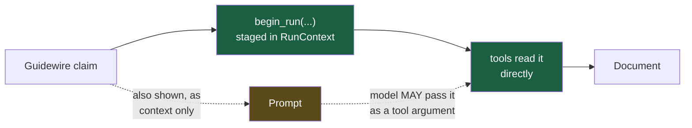

**Solid line = guaranteed. Dotted line = a bonus.** If the model passes nothing, the data still
applies. If it passes something extra, that merges on top. The claim never depends on the model
cooperating.

---

## 2. The whole request, end to end

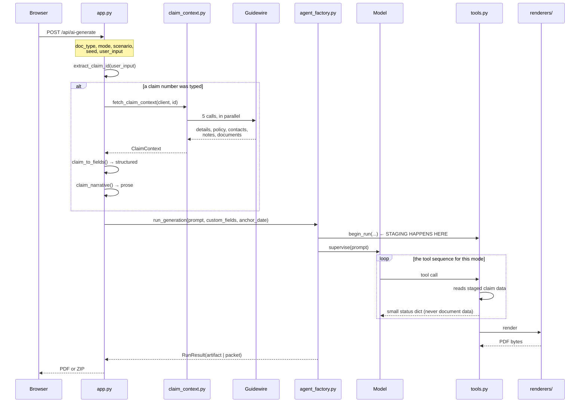

Note what the tools return to the model: **status dicts only**. Field names, counts, sizes. The
document itself never passes through the model's context — it stays server-side in the
`RunContext`. That is why a 5-document packet costs the same context as one.

---

## 3. Guidewire → document fields

### What is fetched

`claim_context.py` calls **five** of the client's methods, in parallel:

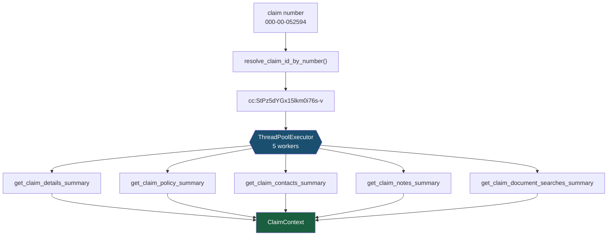

`get_claim_background_context()` exists on the client and would fetch all of this — but it fans
out to **twelve** endpoints serially, and generation needs five. Calling the five directly, in
parallel, is one wall-clock round-trip instead of twelve sequential ones. `guidewire.py` itself is
untouched; this is all in `claim_context.py`.

### The three things a claim produces

| From | Becomes | Used by |
|---|---|---|
| `details` + `policy` + `contacts` | `custom_fields` — structured field values | every mode, applied deterministically |
| `notes[].body_summary` | claim description — prose | generate/recreate as free text; packets as a `scenario_facts` row |
| attached-PDF search hits | excerpts, tagged by category | packets, filtered by relevance to each document type |

### Field mapping

`claim_to_fields()` renames Guidewire's vocabulary to the documents' vocabulary:

```
claim.details["insured"]        → insured_name
claim.details["lossDate"]       → loss_date       (also the date anchor)
claim.details["loss_location"]  → loss_location
claim.details["claim_number"]   → claim_number
claim.policy["policy_type"]     → policy_type
contacts, role="Agent"          → producer_name   (ACORD-25 only)
```

Empty values are **dropped**, not applied. A blank field falls through to generated data instead
of printing an empty box.

---

## 4. Each tool call

Eight tools. The model never sees document data through any of them.

### Generate

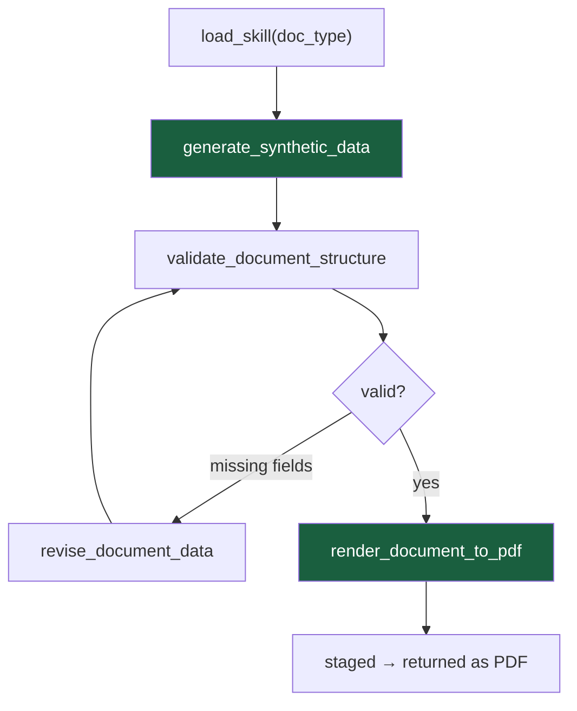

| Tool | Does | Returns to model |
|---|---|---|
| `load_skill` | Andromeda's own — loads that type's field glossary | the skill text |
| `generate_synthetic_data` | builds the data, **then applies staged claim facts** | field names + count |
| `validate_document_structure` | checks required fields on the staged document | `{valid, missing_fields}` |
| `revise_document_data` | merges changes into the staged document | changed + unmapped keys |
| `render_document_to_pdf` | Jinja → WeasyPrint, stages the bytes | `{status, size_bytes}` |

Inside `generate_synthetic_data`:

```python
data = build_synthetic_data(doc_type, scenario, anchor_date=anchor_date or staged_anchor)
_apply_claim_facts(data, resolved_type, _merged_fields(custom_fields))
```

`_merged_fields` is the belt and braces:

```python
{**staged_claim_fields, **(whatever_the_model_passed or {})}
```

Staged is the floor. Anything the model adds merges on top and wins on conflict.

### Recreate

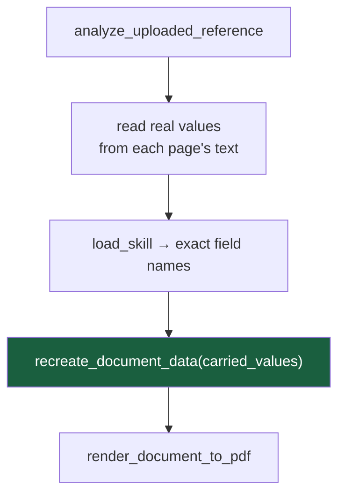

Precedence inside `recreate_document_data` — order matters:

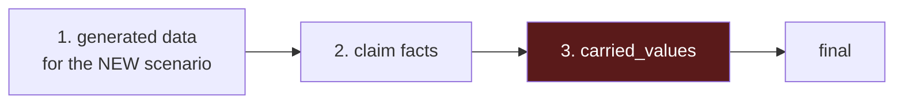

`carried_values` is applied **last** and therefore wins. That is what "recreate" means: the same
people as the uploaded document, not some other claim's. The scenario still drives diagnoses,
procedures, dates of service and amounts.

### Packet

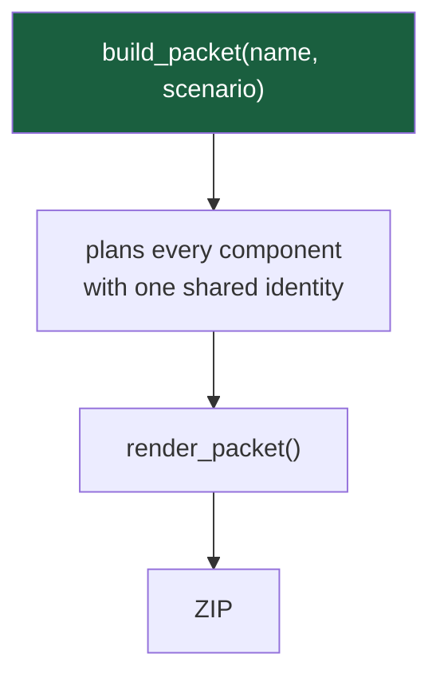

Two calls, no per-component step. The model never loops over components — if it did, each
component would drift.

---

## 5. Why a packet needs a sync layer at all

Each document type is generated independently, and **each names the same thing differently**.
Without a sync layer, one "packet" describes several unrelated events. Real measured output:

| Concept | police-report | auto-accident-report | drift |
|---|---|---|---|
| the crash | `incident_date` = 08/27/2026 | `accident_date` = 03/01/2026 | **5 months apart** |

| Concept | discharge-summary | ub-04 | drift |
|---|---|---|---|
| the stay | `date_of_admission` = 10/15/2024 | `admission_date` = 11/03/2025 | **over a year apart** |

So syncing is done by **concept**, never by field name:

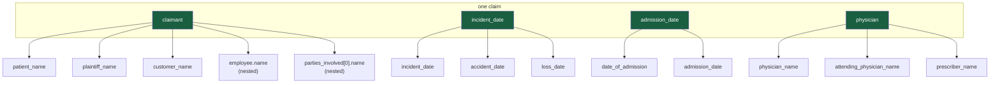

### The one field that must NOT be synced

`provider_name` means different things on different forms:

- on an **EOB** it is the treating clinician — *"Dr. Mary Carlson"*
- on a **UB-04** it is the facility — *"Memorial Health System"*

Treating it as one concept would print a doctor's name in a hospital field. It is therefore mapped
per document type, in `_PER_DOC_ALIASES`, not in a shared group.

### How values are chosen

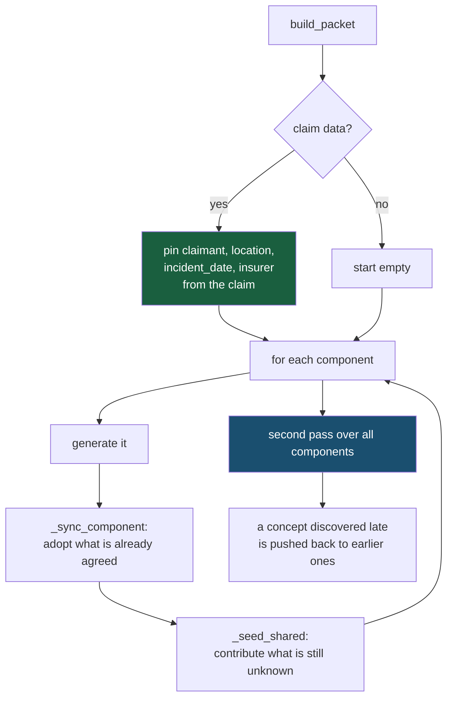

The **second pass** matters: no single document carries every concept. If the first component has
no physician and the third does, the third's physician has to reach back to the first — otherwise
the packet still disagrees with itself.

Claim values are pinned *before* the loop, so they always win over anything a component generates.

---

## 6. Dates: anchored, not patched

A report cannot predate the loss it reports. So the claim's loss date seeds generation **before**
any field is produced, rather than being written over one field afterwards.

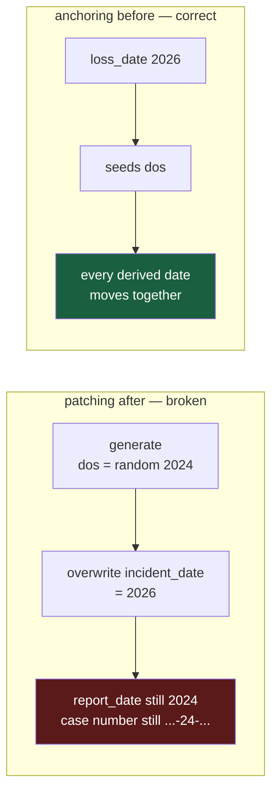

Guidewire returns `2026-08-01T04:01:00.000Z`; these documents render `MM/DD/YYYY`. Claim date
values are reformatted before being applied — otherwise a raw timestamp prints on the page.

---

## 7. Notes and excerpts

The claim's prose is handled differently per mode, on purpose.

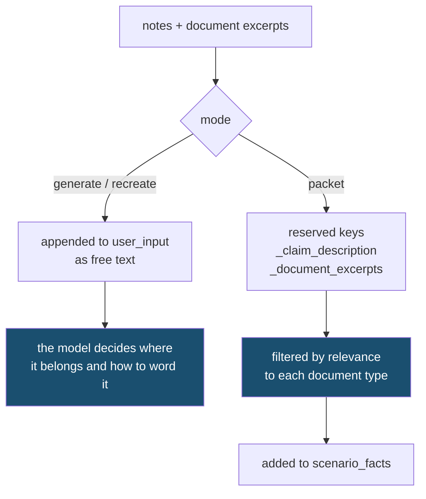

A packet has no per-component model step, so relevance is decided in code by
`_RELEVANT_EXCERPTS`: a police report gets accident-report excerpts, a medical record gets injury
excerpts, and an ACORD-25 certificate gets nothing — it has no narrative section to put one in.

Excerpts are only ever added to `scenario_facts`, which is a section each template already has.
Document types without it are left alone rather than growing a new section.

---

## 8. Worked example

Input: `"auto accident report for claim 000-00-052594"`

| Step | What happens |
|---|---|
| 1 | `extract_claim_id` finds `000-00-052594` |
| 2 | resolved to `cc:StPz5dYGx15lkm0i76s-v` |
| 3 | 5 parallel calls → 16 detail fields, 1 note, 0 excerpts |
| 4 | `claim_to_fields` → `insured_name`, `loss_date`, `claim_number`, `policy_number`, … |
| 5 | `loss_date` `2026-08-01T…Z` → anchor, and reformatted to `08/01/2026` |
| 6 | the note is appended to `user_input` as prose |
| 7 | `begin_run(custom_fields, anchor_date)` — **staged** |
| 8 | model: `load_skill` → `generate_synthetic_data` → `validate` → `render` |
| 9 | inside step 8, claim facts applied by concept: the insured's name lands on `employee.name`, the loss date on `accident_date` |
| 10 | PDF returned; `end_run()` clears the context |

If Guidewire is unreachable, step 3 raises, it is logged, and generation continues fully
synthetic. Claim data is an enrichment, never a requirement.

---

## 9. Where things live

| Question | File |
|---|---|
| What routes exist? | `app.py` |
| How is the claim fetched and mapped? | `claim_context.py` |
| The Guidewire client itself (unmodified) | `guidewire.py` |
| What does each tool do? | `ai_doc_generator/tools.py` |
| What is the model told, per mode? | `ai_doc_generator/prompt_builder.py` |
| Model, sandbox, guardrails, system prompt | `.andromeda/agents/doc-generator.yaml` |
| Which fields mean the same thing? | `_ALIASES` in `tools.py` |
| What data does each document have? | `renderers/synthetic_data.py` |
| Which sections per scenario? | `renderers/components.py` |

---

## 10. The failure modes this design prevents

| Failure | Prevented by |
|---|---|
| Claim data silently not applied | server-side staging, not the prompt |
| Packet documents describing different events | concept-based sync |
| A doctor's name printed in a hospital field | `_PER_DOC_ALIASES` |
| Report dated before the loss | anchoring before generation |
| A raw ISO timestamp on the page | claim date normalization |
| A blank box where a claim had no value | empty values dropped, fall through to generated |
| A blank space from a field the template expects | `StrictUndefined` — fails the build instead |
| State leaking between requests | `begin_run` replaces the context; `run_lock` serialises |
