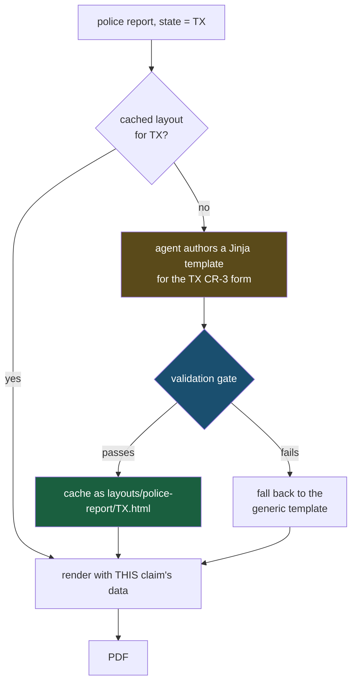

# Plan — per-jurisdiction / per-issuer document layouts

## The problem, stated precisely

Today every police report we generate is visually identical. So is every medical record. For an
IDP test set that is a real defect: an extractor trained or evaluated against it will look far
more robust than it is, because it only ever sees one layout per document type.

But "make it vary" is not one problem. There are **three different axes**, and they need
opposite treatment:

| Tier | Document types | Varies by | Should it vary? |
|---|---|---|---|
| **1. National standard forms** | ACORD 25, CMS-1500, UB-04 | nothing | **No — must stay fixed** |
| **2. Jurisdictional forms** | police report, accident report, property loss notice | **US state** | Yes |
| **3. Issuer house style** | medical record, medical bill, discharge summary | **hospital / EHR vendor** | Yes |

### Tier 1 is already correct, and must be protected

A CMS-1500 is a fixed OMB form. A UB-04 is defined by the NUBC. An ACORD 25 is an ACORD
standard. Their box positions are the same in all 50 states — that is the entire point of them.

So the current fixed template is not a limitation there, it is correct. Worth making explicit:
**this plan must not let these vary**, and there should be a test asserting it. Varying a
CMS-1500 would produce invalid test data, not diverse test data.

### Tier 2 is bounded, not infinite

This is the important correction to "50 states, 50 unknowns". Each state has **one** official
crash report form, with a real name and form number — for example CA's CHP 555, TX's CR-3,
NY's MV-104A. So Tier 2 is not open-ended creativity: it is ~50 *specific, knowable* forms.

That means we can get the field names, section ordering and form numbers genuinely right, which
matters if this test data is ever used to evaluate a real extractor.

> **Verify before shipping:** I am working from general knowledge for the form numbers above. Each
> one should be checked against the state's actual published form before it goes into a profile,
> or we will be generating confidently-wrong test data.

### Tier 3 is genuinely open-ended

There is no official "medical record" form. Layout follows the hospital and its EHR — an Epic
chart note, a Cerner note and a Meditech note look visibly different. Here the variation axis is
the **issuer**, not the state, and the space really is unbounded.

---

## The constraint that shapes everything: ground truth

This is a test-data generator. Its output is only useful if we know **exactly what each document
contains**, so extraction can be scored against it.

So the non-negotiable rule:

> **Data is generated deterministically. Only layout varies. The model never invents a field value.**

Today `synthetic_data.py` produces the values and `StrictUndefined` guarantees the template can't
reference a field that doesn't exist. If we let a model write documents freely, we lose both
guarantees at once — it could silently omit `claim_number`, or invent a second patient name, and
nothing would catch it.

Everything below is built to keep data and layout strictly separate.

---

## Recommended design: the agent authors a **template**, not a document

Your instinct — let the agent write the HTML — is right. One refinement makes it much stronger:

**The agent writes a reusable Jinja template, which we cache — not a finished document.**



Why a template rather than a finished document:

| | Agent writes finished HTML per document | Agent writes a cached template per state |
|---|---|---|
| Cost | one LLM call **per document** | one call **per state, ever** |
| Reproducible with a seed | no | **yes** |
| Ground truth | must re-derive from output | **unchanged — data layer still owns it** |
| Reviewable / hand-editable | no | **yes, it is a file** |
| Packet of 5 docs | 5 authoring calls | 0 (all cached) |
| Variety across states | high | **high — same thing** |

You get the same visual diversity, because the diversity lives in the layout, and each state gets
its own. You just stop paying for it on every single document.

The cache is a plain directory of `.html` files. Anyone can open `layouts/police-report/TX.html`,
fix a heading, and commit it. Over time the good ones become hand-maintained assets and the agent
is only invoked for states nobody has done yet.

---

## The validation gate (this is what makes it safe)

A generated template is **not trusted** until it passes, in this order:

1. **Renders** — Jinja parses it and it renders under `StrictUndefined` against a probe data dict.
   Catches references to fields that don't exist.
2. **Field audit** — every value in `_REQUIRED_FIELDS[doc_type]` must appear in the rendered
   output. This is the replacement for the guarantee we'd otherwise lose: a layout that silently
   drops the claim number is **rejected**, not cached.
3. **Prints** — WeasyPrint produces a PDF over a page-count sanity range. Catches CSS that
   explodes into 400 pages.
4. **Not a copy** — its structural fingerprint differs from the generic template, or we have
   gained nothing.

Fail any check → discard, fall back to today's template, and record why. The system degrades to
current behavior instead of producing a broken document.

---

## Where the skill files fit

You were right that this belongs in the skills. Today:

```
skills/police-report/
├── SKILL.md
└── references/
    ├── field-glossary.md
    ├── rendering-spec.md
    └── test-scenarios.md
```

`rendering-spec.md` currently describes **one** design ("dark navy `#14304f` title bar reading
TRAFFIC COLLISION REPORT"). That is exactly the file that hard-codes the sameness.

The change:

- **`rendering-spec.md`** is reframed from *"this is the design"* to *"these are the design
  invariants"* — page size, the SPECIMEN watermark, the synthetic-data footer, minimum legibility.
  Things that must hold for **every** variant.
- **New `references/jurisdictions.md`** — the per-state knowledge: form name, form number, issuing
  agency, section ordering, notable quirks. This is what the agent reads to author a faithful TX
  form instead of a generic one.
- **`SKILL.md`** gains a short "Layout variants" section pointing at both.

For Tier 3, the same shape but the file is `references/issuers.md` (Epic / Cerner / Meditech
house styles) instead of `jurisdictions.md`.

---

## Code changes

### New: `renderers/layouts.py`
Cache lookup and storage. `get_layout(doc_type, key) -> template_name | None`, plus
`save_layout(...)` gated on validation. Owns the `layouts/` directory.

### New: `renderers/layout_validator.py`
The four checks above. Pure functions, no LLM, fully unit-testable — this is the piece that has
to be trustworthy.

### New tool: `author_layout(doc_type, jurisdiction)`
Only tool that writes HTML. Called by the agent only on a cache miss.

### `renderers/synthetic_data.py`
Promote the variation key to a real field. Police report already picks
`report_state = random.choice(_STATES)` at line 1180 — it just doesn't reach the template. Expose
it as `layout_key` so the renderer can dispatch on it. Medical types get an issuer instead.

### `renderers/html_renderer.py`
`render_html(template_name, data)` first checks for a cached layout matching `data["layout_key"]`
and falls back to the generic template. Roughly a five-line change — this is the only place that
needs to know variants exist.

### `ai_doc_generator/registry.py`
Mark each doc type's tier: `"layout_axis": None | "state" | "issuer"`. `None` means Tier 1 and is
never varied.

### `ai_doc_generator/tools.py`
`_REQUIRED_FIELDS` becomes the contract the field audit enforces. No structural change.

---

## Rollout

1. **Guard Tier 1 first.** Add the test asserting ACORD-25 / CMS-1500 / UB-04 never resolve to a
   variant layout. Do this before anything else exists, so it can't regress.
2. **Build the validator**, with tests, against hand-written good and deliberately broken
   templates. No LLM involved yet.
3. **Cache plumbing + renderer dispatch**, with two hand-written police-report layouts (say CA and
   TX). Still no LLM. At this point the system already produces two visibly different police
   reports — worth confirming that alone looks right before adding generation.
4. **`author_layout` tool + `jurisdictions.md`** for police-report only. Generate a handful of
   states, review the HTML by eye, iterate on the skill text until output is consistently good.
5. **Backfill states** in bulk, then hand-correct.
6. **Tier 3** (medical, issuer axis) reusing the whole mechanism.

Stopping after step 3 already gets you most of the value if the LLM authoring proves fiddly. That
is deliberate — each step is useful on its own.

---

## Open questions for you

1. **How many states realistically?** All 50, or the ~10 that matter for your test corpus? The
   answer changes whether hand-authoring (accurate) or LLM-authoring (scalable) is the better
   default.
2. **Should the state be selectable in the UI**, or always random? Selectable makes it possible to
   ask for "a Texas crash report" deliberately, which is likely what a tester wants.
3. **How faithful must Tier 2 be?** "Recognizably a TX form" (looser, easier) versus "field-level
   faithful to CR-3" (needs the real form as reference). This is the single biggest scoping
   decision.
4. **Do you have real specimens?** Even 3-4 real (redacted) state forms would raise output quality
   sharply, and could be fed in via the existing recreate-mode reference upload.
