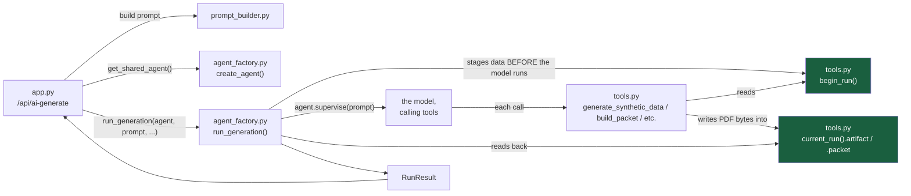
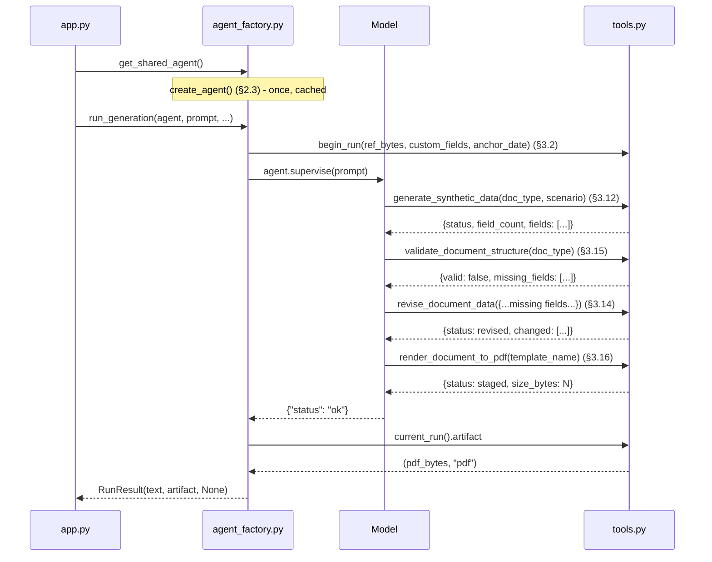
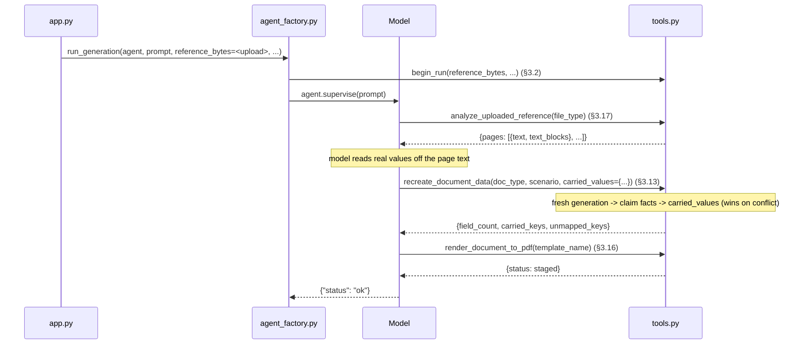
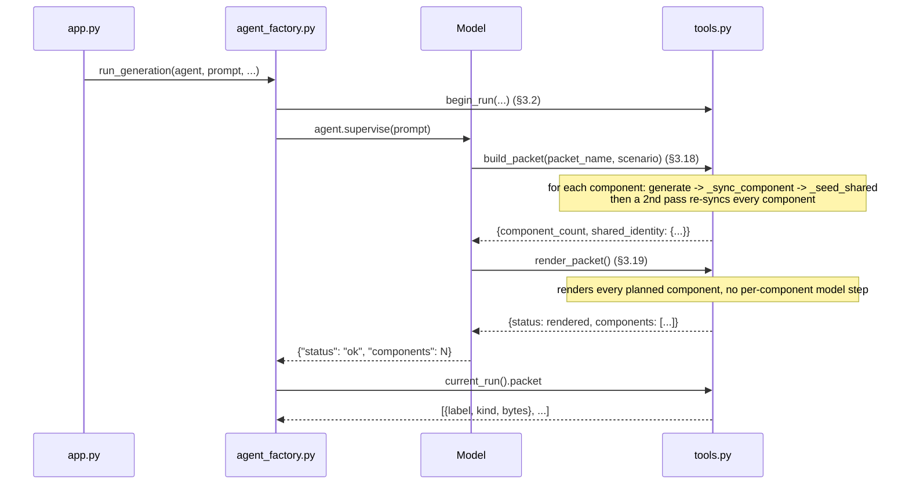
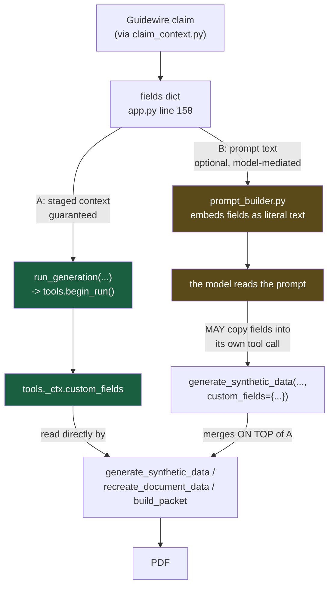
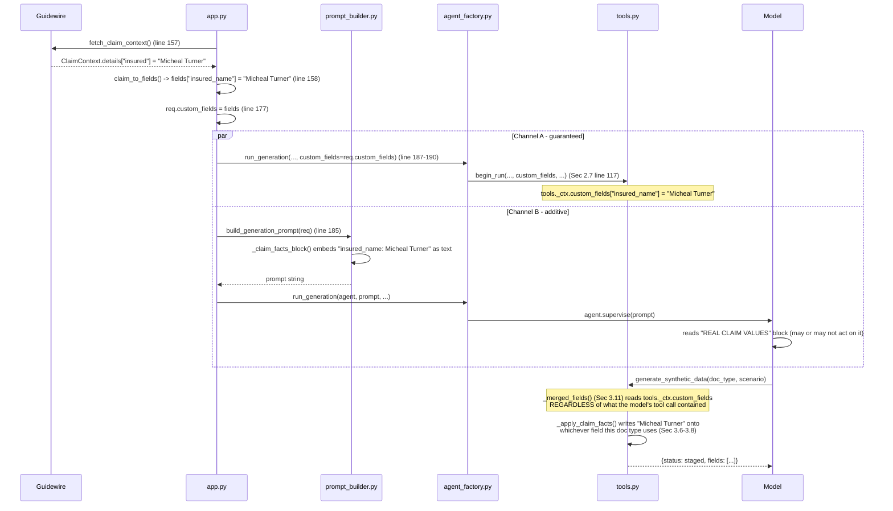
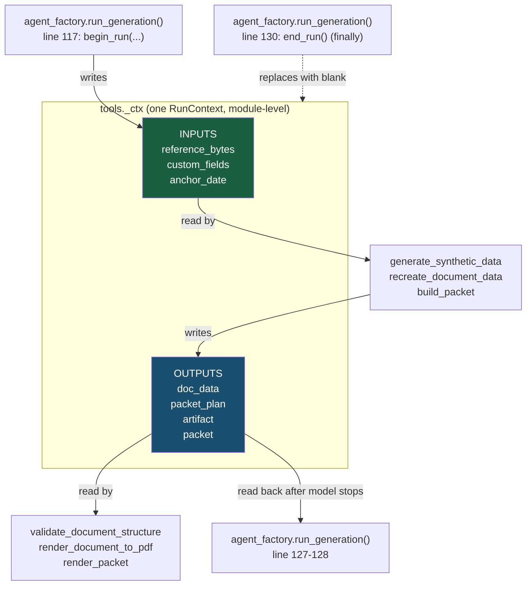

# Helper: `agent_factory.py` and `tools.py`, line by line

This is a deep-dive into the two files that actually run the AI agent:
`ai_doc_generator/agent_factory.py` (builds the agent, runs one request) and
`ai_doc_generator/tools.py` (the 8 functions the agent is allowed to call).

Read this top to bottom once, then use it as a reference — every section names
the exact lines it explains.

---

## 1. The 30-second mental model



**The one idea everything else hangs off**: the document's *data* never travels
through the model. `agent_factory.py` stages it in a shared object
(`tools._ctx`, a `RunContext`) **before** the model starts talking, and the
tools in `tools.py` read that object directly. The model's job is only to call
the right tools in the right order — it never sees, holds, or has to
faithfully repeat a claim number, a name, or a date.

---

## 2. `agent_factory.py`, line by line

### 2.1 Imports and module state (lines 1–9)

```python
1  import threading
2  from dataclasses import dataclass
3  from pathlib import Path
4
5  from . import tools
6  from .tools import agent_tools
7
8  _PROJECT_ROOT = Path(__file__).parent.parent
9  _AGENT_CONFIG = _PROJECT_ROOT / ".andromeda" / "agents" / "doc-generator.yaml"
```

- **Line 5**: imports the whole `tools` module (not just names from it) — needed
  because this file calls `tools.begin_run(...)`, `tools.end_run()`,
  `tools.current_run()`, `tools.run_lock` as *module-level* functions/objects,
  which have to stay looked-up-by-name so they always see the current state.
- **Line 6**: `agent_tools()` is the one function in `tools.py` that wraps the 8
  plain Python functions as Andromeda `Tool` objects (see §3.15).
- **Line 8–9**: `_PROJECT_ROOT` is `test_data_generator/`. `_AGENT_CONFIG` points
  at `test_data_generator/.andromeda/agents/doc-generator.yaml` — the file that
  is the *entire* configuration of the agent (model, prompt, guardrails,
  sandbox). Nothing about the agent's behaviour is hardcoded in this `.py` file
  except what YAML literally cannot express (see §2.3).

### 2.2 `ScopedDirectorySeed` (lines 12–24)

```python
12 @dataclass(frozen=True)
13 class ScopedDirectorySeed:
14
15     source_dir: str
16     subpaths: tuple[str, ...]
17
18     def apply(self, root, policy) -> None:
19         from andromeda.workspace import DirectorySeed
20
21         for sub in self.subpaths:
22             src = Path(self.source_dir) / sub
23             if src.is_dir():
24                 DirectorySeed(source_dir=str(src), target_path=sub).apply(root, policy)
```

The agent runs inside a **workspace** — a directory the framework hands the
model access to (via `read_file`, `list_directory`, etc. tools it auto-adds).
By default a workspace mirrors the whole project. `ScopedDirectorySeed` narrows
that to *only* `subpaths` — in this project, only `("skills",)` (see line 64).
That means the model can browse `skills/police-report/references/...` but
never sees `app.py`, `guidewire.py`, or anything else — it has no reason to,
and no way to.

`apply(root, policy)` is called by the framework itself when the session is
created; it is not something this codebase calls directly.

### 2.3 `create_agent()` (lines 27–69) — the important one

```python
27 def create_agent():
28     try:
29         from andromeda.config import WorkspaceAgentConfig
30         from andromeda.core import WorkspaceAgent
31         from andromeda.tools.toolkit import register_tool
32         from andromeda.workspace import (
33             BubblewrapProcessSettings,
34             FilePolicy,
35             WorkspacePolicy,
36             WorkspaceSession,
37         )
38     except ImportError as e:
39         raise RuntimeError(
40             f"The Andromeda framework is not importable ({e}). Install it from the "
41             f"Andromeda repository: pip install -e path/to/andromeda"
42         ) from e
```
Imports of the `andromeda` package are **inside the function**, not at module
top. That is deliberate: importing `agent_factory` (e.g. from a test) must not
require the whole framework to be installed. Only *calling* `create_agent()`
does. If the import fails, this turns a cryptic `ModuleNotFoundError` into an
actionable message.

```python
44     tool_objects = agent_tools()
45     for t in tool_objects:
46         register_tool(t)
```
`agent_tools()` (defined in `tools.py`, §3.15) wraps the 8 plain functions into
LangChain `StructuredTool` objects. `register_tool` tells Andromeda's internal
tool registry these tools exist — separate from actually attaching them to
*this* agent, which happens two lines later.

```python
48     config = WorkspaceAgentConfig.load_from_file(str(_AGENT_CONFIG), resolve_tools=False)
49     config.tools = tool_objects
```
**This is the line that loads `doc-generator.yaml`.** Everything the YAML
declares — `model:`, `workspace_backend:`, `middleware.guardrails:`,
`prompt:`, `recursion_limit:` — becomes fields on `config`.
`resolve_tools=False` tells the loader "don't try to resolve a `tools:` list
from the YAML" (there isn't one — tool *objects* can't be expressed in YAML,
only names could be, and this project doesn't use that mechanism). Line 49
attaches the actual Python tool objects built two lines above.

```python
51     backend = config.workspace_backend
```
Reads back whatever the YAML said (`ephemeral_fs`, or `bubblewrap_process` if
you change it) as a plain string, used below to decide how to build the
sandbox.

```python
53     policy = WorkspacePolicy(
54         read_only=False,
55         enable_shell=False,
56         file=FilePolicy(max_file_size_mb=20, allow_symlinks=False, protect_root=True),
57     )
```
`WorkspacePolicy` is a **separate class** from `WorkspaceAgentConfig` — it has
no YAML representation in this project, so it's built here directly in Python.
`enable_shell=False` is the one line that matters most for safety: the model
can never run a shell command, no matter what the prompt says. `protect_root`
stops it writing outside its sandboxed directory; `allow_symlinks=False` closes
a symlink-escape route; `max_file_size_mb=20` is a sane cap for a generated PDF.

```python
58     settings = None
59     if backend == "bubblewrap_process":
60         settings = BubblewrapProcessSettings(network_mode="none", inherit_host_env=False)
```
Only relevant if `workspace_backend: bubblewrap_process` in the YAML (real OS
sandboxing, Linux-only, needs `bubblewrap` installed). `network_mode="none"`
means the sandboxed process has **no network access at all** — the model
cannot make an HTTP call even if it wanted to. On `ephemeral_fs` (the current
default — an unsandboxed local workspace, portable to any OS) this whole block
is skipped; there is no OS-level sandbox to configure.

```python
62     session = WorkspaceSession.create(
63         backend=backend,
64         seed=ScopedDirectorySeed(source_dir=str(_PROJECT_ROOT), subpaths=("skills",)),
65         policy=policy,
66         settings=settings,
67     )
```
Builds the actual workspace: which backend, seeded with only `skills/`
(§2.2), governed by the policy from line 53.

```python
69     return WorkspaceAgent(config, agents=[], session=session, min_agents=1)
```
Assembles everything into one `WorkspaceAgent` object and returns it.
`agents=[]` means no sub-agents — this is a single agent working alone,
matching the YAML's `allow_parallel_agents: false`.

### 2.4 The shared-agent cache (lines 72–90)

```python
72 _agent = None
73 _agent_lock = threading.Lock()
74
75
76 def get_shared_agent():
77     global _agent
78     if _agent is None:
79         with _agent_lock:
80             if _agent is None:
81                 _agent = create_agent()
82     return _agent
```
`create_agent()` is expensive — it seeds a sandbox and compiles a LangGraph
execution graph, on the order of tens of seconds. This is the classic
**double-checked locking** pattern: the first check (line 78) avoids taking a
lock on the common case (agent already built); the lock (line 79) protects
against two requests racing to build it *simultaneously* the first time;
the second check (line 80) is what actually prevents the race — without it,
two threads could both pass the first `if` and both build an agent. One
process-wide agent instance serves every request.

```python
85 def close_shared_agent() -> None:
86     global _agent
87     with _agent_lock:
88         if _agent is not None:
89             _agent.close()
90             _agent = None
```
Called from `app.py`'s FastAPI shutdown hook — releases the sandbox session
cleanly when the server stops.

### 2.5 `_final_text()` (lines 93–102)

```python
93 def _final_text(messages: list):
94     from langchain_core.messages import AIMessage
95
96     for m in reversed(messages):
97         if not isinstance(m, AIMessage):
98             continue
99         content = getattr(m, "content", None)
100        if (isinstance(content, str) and content.strip()) or (isinstance(content, list) and content):
101            return content
102    return None
```
After a run, the model's conversation is a list of messages — human, AI (the
model's own turns), and tool-result messages. The model's **last** message is
often a tool call with no accompanying text (it just called a tool and moved
on). This walks the list **backwards** looking for the most recent `AIMessage`
that actually has non-empty content, and returns that. If nothing qualifies —
e.g. the run failed entirely — returns `None`. This is diagnostic text only
(used in the error message in `app.py` when generation produces nothing); it
is never parsed as the source of the document.

### 2.6 `RunResult` (lines 105–109)

```python
105 @dataclass
106 class RunResult:
107     text: str | list | None
108     artifact: tuple[bytes, str] | None
109     packet: list[dict] | None
```
The plain return value of `run_generation()`. `artifact` is `(pdf_bytes,
"pdf")` for a single document; `packet` is a list of `{label, kind, bytes}`
for a packet run. Exactly one of `artifact`/`packet` is populated on success;
both are `None` if the model never got as far as rendering anything.

### 2.7 `run_generation()` (lines 112–130) — runs one request end to end

```python
112 def run_generation(agent, prompt: str, reference_bytes: bytes | None = None,
113                    custom_fields: dict | None = None, anchor_date: str | None = None) -> RunResult:
```
Called once per `/api/ai-generate` request, from `app.py`.

```python
114     from langchain_core.messages import HumanMessage
115
116     with tools.run_lock:
```
**`tools.run_lock` serialises every generation request through this one
block.** The shared agent (one process-wide instance) and the module-level
`tools._ctx` are both single, mutable, global state. If two requests ran this
function concurrently without a lock, request B's `begin_run()` could
overwrite request A's staged data mid-flight — A's PDF would come out with
B's claim number. The lock trades throughput (one document generates at a
time) for correctness (no cross-request data bleed). This is the load-bearing
line for the whole "staged data, not prompt data" design working safely.

```python
117         tools.begin_run(reference_bytes, custom_fields, anchor_date)
```
**This is the staging step** — see §3.2. Everything the tools will read for
this run is set up *before* the model ever sees the prompt.

```python
119         agent.memory.clear()
120         agent.plan.clear()
121         for coworker in agent.agents:
122             coworker.memory.clear()
```
The shared agent (§2.4) is reused across requests — its LangGraph state
(`memory`, `plan`) would otherwise carry over from the *previous* request's
conversation into this one. Clearing it here means every request starts from
a genuinely blank conversation. `agent.agents` is empty in this project (§2.3,
`agents=[]`), so this loop is a no-op today, but stays correct if that ever
changes.

```python
124         try:
125             result = agent.supervise({"messages": [HumanMessage(content=prompt)], "plan": []})
```
**This is where the model actually runs.** `agent.supervise(...)` hands the
prompt (built by `prompt_builder.py` — see §4) to the model as a single human
turn, and the framework drives the whole tool-calling loop: model reads
prompt → decides to call a tool → framework executes it (calling straight into
`tools.py`) → result goes back to the model → repeat until the model produces
a final text answer or hits `recursion_limit` (300, from the YAML).

```python
126         messages = result.get("messages", []) if isinstance(result, dict) else []
127         ctx = tools.current_run()
128         return RunResult(_final_text(messages), ctx.artifact, ctx.packet)
```
After the model stops, this reads `tools.current_run()` — the **same staged
object** from line 117, now mutated by whichever tools ran — and pulls out
whatever got staged into `.artifact` / `.packet`. `_final_text(messages)`
(§2.5) is only used for diagnostics if both are empty.

```python
129         finally:
130             tools.end_run()
```
**Always** clears the staged context, whether the run succeeded, raised, or
produced nothing — so the *next* request (once it gets the lock) starts from
a guaranteed-clean `RunContext`, never a leftover from this one.

---

## 3. `tools.py`, line by line

### 3.1 Imports (lines 1–11)

```python
1  import random
2  import threading
3  from dataclasses import dataclass, field
4
5  from faker import Faker
6
7  from renderers import render_html_to_pdf
8  from renderers.docx_parser import extract_docx_layout
9  from renderers.synthetic_data import _parse_anchor_date, build_synthetic_data, resolve_doc_type
10
11 from .registry import PACKET_REGISTRY
```
Notice there is **no** `import andromeda` here at module level — `tools.py`
only reaches for `andromeda.tools.tool` inside `agent_tools()` (§3.15), for
the same reason as `agent_factory.py`: this module has to stay importable
(for tests, for `app.py`'s Guidewire path) without the framework installed.

### 3.2 `RunContext` and the module-level staging area (lines 14–48)

```python
14 @dataclass
15 class RunContext:
16
17     reference_bytes: bytes | None = None
18     custom_fields: dict = field(default_factory=dict)
19     anchor_date: str | None = None
20
21     doc_data: dict | None = None
22     packet_plan: list[dict] | None = None
23     artifact: tuple[bytes, str] | None = None
24     packet: list[dict] | None = None
```
Two groups of fields. **Lines 17–19 are inputs** — set once at the start of a
run, from `begin_run()`, and never changed after. **Lines 21–24 are
outputs** — start empty, get filled in by whichever tools the model calls
during the run.

```python
27 run_lock = threading.Lock()
28
29 _ctx = RunContext()
```
`_ctx` is **module-level, mutable, global state** — there is exactly one
`RunContext` object alive at any moment for the whole process. This is what
`run_lock` (used in `agent_factory.py`, §2.7) protects.

```python
32 def begin_run(reference_bytes: bytes | None = None, custom_fields: dict | None = None,
33               anchor_date: str | None = None) -> None:
34     global _ctx
35     _ctx = RunContext(
36         reference_bytes=reference_bytes,
37         custom_fields=custom_fields or {},
38         anchor_date=anchor_date,
39     )
```
**Replaces** `_ctx` with a brand-new `RunContext` — doesn't mutate the old one,
throws it away entirely. This is why a stale value from a previous run can
never leak through by accident: there's no old object left to accidentally
read from.

```python
42 def end_run() -> None:
43     global _ctx
44     _ctx = RunContext()
```
Same pattern — replaces `_ctx` with a **blank** context (all defaults). Called
in `agent_factory.py`'s `finally` block (§2.7, line 130).

```python
47 def current_run() -> RunContext:
48     return _ctx
```
The only way any tool function reads staged data — always goes through this,
never touches `_ctx` directly (except `begin_run`/`end_run` themselves, which
own it).

### 3.3 `_overlay()` (lines 51–65) — the generic "fill in known fields" merge

```python
51 def _overlay(dst: dict, src: dict, path: str = "", unmapped: list | None = None) -> list:
52     if unmapped is None:
53         unmapped = []
54     for key, value in (src or {}).items():
55         full = f"{path}.{key}" if path else key
56         if key not in dst:
57             unmapped.append(full)
58         elif isinstance(dst[key], dict):
59             if isinstance(value, dict):
60                 _overlay(dst[key], value, full, unmapped)
61             else:
62                 unmapped.append(full)
63         else:
64             dst[key] = value
65     return unmapped
```
Walks every key in `src` and writes it onto `dst`, **only if `dst` already has
that key** (line 56 — an unknown key is recorded as "unmapped", never
silently added). If the existing value in `dst` is itself a nested dict (e.g.
an `address` sub-object), it recurses into it (line 60) rather than replacing
the whole structure with a flat value — line 62 explicitly *rejects* trying to
overwrite a structured field with a scalar, because that would silently break
every template line that reads `address.street` afterwards. The `path`
parameter builds a dotted breadcrumb (`"address.street"`) purely for the
`unmapped` diagnostic list returned to the model.

This one function backs three different call sites: applying claim facts
(§3.5), applying an uploaded document's carried values in `recreate_document_data`
(§3.10), and applying ad-hoc field edits in `revise_document_data` (§3.9).

### 3.4 The concept-alias tables (lines 68–97)

```python
68 _ALIASES = {
69     "claimant": ("patient_name", "insured_name", "claimant_name", "plaintiff_name",
70                  "driver_name", "subscriber_name", "benefit_patient_name",
71                  "customer_name", "contact_person"),
72     "location": ("location", "accident_location", "loss_location"),
73     "incident_date": ("incident_date", "accident_date", "loss_date"),
74     "dob": ("dob", "insured_dob"),
75     "member_id": ("insurance_id", "insured_id"),
76     "group_no": ("group_number", "insurance_group_no"),
77     "physician": ("physician_name", "attending_physician_name",
78                   "operating_physician_name", "prescriber_name"),
79     "facility": ("hospital", "pay_to_name", "billing_provider_name"),
80     "insurer": ("insurer_name", "payer_name"),
81     "admission_date": ("date_of_admission", "admission_date"),
82     "discharge_date": ("date_of_discharge", "discharge_date"),
83 }
```
**The problem this solves**: a medical form calls the claimant `patient_name`;
a lawsuit complaint calls the same person `plaintiff_name`; an auto report
calls them `insured_name` or `driver_name`. If a packet syncs by literal field
name, a claim's `insured_name` would land on some documents and silently miss
every document that happens to use a different word for the same concept —
which is exactly how a packet's own documents used to disagree with each
other about who the claimant even was.

Each key here (`"claimant"`, `"location"`, ...) is a **concept**, not a field
name. The tuple is every field name across every document type that means
that concept. Setting the concept once (§3.6, `_apply_concept`) writes it onto
whichever of those field names the *current* document actually has.

```python
85 _PER_DOC_ALIASES = {
86     "eob-explanation": {"provider_name": "physician"},
87     "ub-04": {"provider_name": "facility"},
88 }
```
`provider_name` cannot go in `_ALIASES` above: on an EOB it means the
*treating clinician*, on a UB-04 it means the *hospital/facility* — two
different real-world things sharing one field name. This table says "on this
specific doc type, this specific field maps to this concept" — narrower and
looked up only for the one doc type it applies to (§3.6, line 102).

```python
90 _PACKET_SHARED_FIELDS = (
91     "gender", "address", "phone", "mrn", "npi", "specialty", "dea",
92     "claim_number", "policy_number",
93     "dos", "dos_from", "dos_to", "service_date",
94 )
```
Fields that are spelled identically everywhere they appear, so a plain
same-name match is enough — no alias table needed. Used only in
`_seed_shared()` (§3.8).

```python
96 _CLAIM_DATE_FIELDS = ("loss_date", "reported_date", "policy_effective_date",
97                       "policy_expiration_date")
```
The claim fields that are *dates*, coming from Guidewire as ISO timestamps
(`"2026-08-01T04:01:00.000Z"`) while every document renders `MM/DD/YYYY`.
Listed here so `_normalize_claim_dates()` (§3.7) knows which keys to reformat.

### 3.5–3.6 Applying one concept (lines 100–128)

```python
100 def _alias_fields(doc_type: str | None, concept: str) -> list[str]:
101     fields = list(_ALIASES.get(concept, ()))
102     for field_name, mapped in _PER_DOC_ALIASES.get(doc_type or "", {}).items():
103         if mapped == concept:
104             fields.append(field_name)
105     return fields or [concept]
```
Given a doc type and a concept name, returns every field name on *that*
document type that carries the concept — the general alias list (line 101)
plus any per-doc-type addition (line 102–104). Line 105's `fields or
[concept]` is a fallback: if `concept` isn't a registered alias at all (e.g.
it's a literal field name from `_PACKET_SHARED_FIELDS` being pushed through
this same machinery), treat the concept string itself as the one field name.

```python
108 def _apply_concept(data: dict, doc_type: str | None, concept: str, value) -> None:
109     if value is None:
110         return
111     for f in _alias_fields(doc_type, concept):
112         if f in data:
113             data[f] = value
114     if concept != "claimant":
115         return
116     parties = data.get("parties_involved")
117     if isinstance(parties, list) and parties:
118         parties[0]["name"] = value
119     employee = data.get("employee")
120     if isinstance(employee, dict):
121         employee["name"] = value
```
Writes `value` onto every alias field this doc type has for `concept` (lines
111–113) — silently skipping ones it doesn't have (`if f in data`), same
principle as `_overlay`'s line 56. Lines 114–121 are two special cases,
**only** for the `"claimant"` concept, because two document types nest the
claimant's name instead of keeping it as a flat top-level field:
- `parties_involved[0]` — a police report's Driver 1 / reporting party is
  always index 0 by construction (see `renderers/synthetic_data.py`); index 1
  onward is the *other* party and is deliberately left untouched — claim data
  describes the insured, not whoever they collided with.
- `employee` — an auto-accident-report's "STATE EMPLOYEE" block is the
  insured driver's identity, nested under its own key.

```python
124 def _read_concept(data: dict, doc_type: str | None, concept: str):
125     for f in _alias_fields(doc_type, concept):
126         if data.get(f):
127             return data[f]
128     return None
```
The inverse operation: given a document's data, what value (if any) does it
already hold for a concept? Used only by `_seed_shared()` (§3.8) to discover
values a packet component generated on its own, so they can be pushed onto
sibling components.

### 3.7 `_normalize_claim_dates()` (lines 131–137)

```python
131 def _normalize_claim_dates(fields: dict) -> dict:
132     out = dict(fields)
133     for key in _CLAIM_DATE_FIELDS:
134         parsed = _parse_anchor_date(out.get(key))
135         if parsed:
136             out[key] = parsed.strftime("%m/%d/%Y")
137     return out
```
`dict(fields)` on line 132 makes a **shallow copy** — this function never
mutates the caller's dict. For each of the four known date fields (§3.4, line
96–97), if `_parse_anchor_date` (imported from `renderers/synthetic_data.py`)
can parse the raw value (handles ISO timestamps, `MM/DD/YYYY`, and plain
dates), it's overwritten in the copy with the `MM/DD/YYYY` string every
template expects. If parsing fails, the original raw value passes through
unchanged (better a slightly-wrong-looking date than a silently dropped one).

### 3.8 `_apply_claim_facts()` (lines 140–147) — one document, one shot

```python
140 def _apply_claim_facts(data: dict, doc_type: str, custom_fields: dict) -> None:
141     if not custom_fields:
142         return
143     fields = _normalize_claim_dates(custom_fields)
144     _overlay(data, fields)
145     _apply_concept(data, doc_type, "claimant", fields.get("insured_name"))
146     _apply_concept(data, doc_type, "location", fields.get("loss_location"))
147     _apply_concept(data, doc_type, "incident_date", fields.get("loss_date"))
```
Called from `generate_synthetic_data` and `recreate_document_data` — the two
*single-document* tools. Order matters:
1. Normalize dates (§3.7).
2. `_overlay` (§3.3) does a literal field-name pass — catches any claim field
   whose name happens to match a field this doc type already has, verbatim
   (e.g. `claim_number`, `policy_number` — these are spelled the same
   everywhere so need no aliasing).
3. Three explicit concept applications catch the fields that *do* need
   aliasing: who the claimant is, where it happened, when it happened. These
   three are hardcoded here (not looped over every `_ALIASES` key) because a
   single document isn't syncing against siblings — it just needs the claim's
   own three headline facts applied once.

### 3.9 The excerpt-relevance table and `_sync_component()` (lines 150–186)

```python
150 _RELEVANT_EXCERPTS = {
151     "police-report": ("police report", "accident report", "tow"),
152     "auto-accident-report": ("police report", "accident report", "tow"),
153     "medical-record": ("injury", "medical", "bodily injury"),
154     "medical-bill": ("injury", "medical", "bodily injury", "payment", "settlement"),
155     "discharge-summary": ("injury", "medical", "bodily injury"),
156     "property-loss-notice": ("estimate", "appraisal", "photo", "inspection",
157                              "total loss", "salvage", "title"),
158     "eob-explanation": ("payment", "settlement", "injury", "medical"),
159     "demand-letter": ("police report", "accident report", "injury", "medical"),
160     "litigation-document": ("police report", "accident report", "injury", "medical"),
161     "ub-04": ("injury", "medical", "payment"),
162     "pharmacy-invoice": ("injury", "medical"),
163 }
```
In single-document mode, the model reads claim narrative/excerpts as free text
in the prompt and judges relevance itself. A **packet** has no such per-model
step (§3.13 shows why — it's two deterministic tool calls, nothing else), so
this table encodes that judgment in code instead: which excerpt *categories*
(Guidewire's own keyword tags, e.g. `"police report|accident report"`) belong
on which document type. Doc types absent from this table (e.g. `acord-25`)
get **no** excerpts — a certificate of insurance has no narrative section to
put one in anyway.

```python
166 def _sync_component(data: dict, doc_type: str, shared: dict, custom_fields: dict,
167                     claim_description: str | None, excerpts: list | None) -> None:
168     _apply_claim_facts(data, doc_type, custom_fields)
169     for concept, value in shared.items():
170         _apply_concept(data, doc_type, concept, value)
```
Line 168: apply the raw claim facts (§3.8), same as a single document would.
Line 169–170: **then** apply every concept currently in `shared` — this is the
packet-wide agreed values dict, built up as `build_packet` iterates its
components (§3.13). This second step is what makes a packet's documents agree
with *each other*, not just with the claim.

```python
172     if not isinstance(data.get("scenario_facts"), list):
173         return
174     extra = []
175     if claim_description:
176         extra.append({"label": "Claim Description", "value": claim_description})
177     for ex in excerpts or []:
178         if any(kw in ex.get("category", "") for kw in _RELEVANT_EXCERPTS.get(doc_type, ())):
179             extra.append({
180                 "label": f"Claim File Excerpt ({ex.get('source', 'attached document')})",
181                 "value": ex.get("text", ""),
182             })
183     if extra:
184         data["scenario_facts"] = data["scenario_facts"] + extra
185         if not data.get("scenario_facts_title"):
186             data["scenario_facts_title"] = "Claim File Details"
```
Line 172: `scenario_facts` is a list every document type's data *may* have
(it's the one general-purpose "extra detail" slot each template already
renders). Types that don't have it get nothing added — no new UI section is
invented for a type that never had one. Lines 174–182 build a list of extra
rows: the adjuster's own claim description (if any), plus each excerpt whose
`category` string contains one of this doc type's relevant keywords (line
178). Line 184 **appends**, doesn't replace, so anything `build_synthetic_data`
already put there (scenario-specific facts) survives. Line 185–186 only sets a
title if the document didn't already have one from generation.

### 3.10 `_seed_shared()` (lines 189–197) — learning from a component

```python
189 def _seed_shared(shared: dict, data: dict, doc_type: str) -> None:
190     for concept in _ALIASES:
191         if not shared.get(concept):
192             value = _read_concept(data, doc_type, concept)
193             if value:
194                 shared[concept] = value
195     for field_name in _PACKET_SHARED_FIELDS:
196         if not shared.get(field_name) and data.get(field_name):
197             shared[field_name] = data[field_name]
```
Runs *after* a component has been generated and synced. For every concept
`shared` doesn't already have a value for (line 191), asks this component
whether it happens to have generated one (line 192, `_read_concept`, §3.6) and
records it if so (line 193–194). Same for the plain `_PACKET_SHARED_FIELDS`
(lines 195–197). This is how a packet with **no external claim data at all**
still ends up internally consistent: the first component to generate a
physician's name "wins", and every later component adopts it via
`_sync_component`'s line 169–170 — but only if it was called *after* this
seeding ran (see §3.13's two-pass loop for why one pass isn't enough).

### 3.11 `_merged_fields()`, `_stage_doc_data()`, `_require_doc_data()` (lines 200–222)

```python
200 def _merged_fields(custom_fields: dict | None) -> dict:
201     return {**current_run().custom_fields, **(custom_fields or {})}
```
The "belt and braces" merge: `current_run().custom_fields` is what
`agent_factory.begin_run()` staged **before the model ran** — the reliable
floor. `custom_fields` here is whatever the *model itself* passed as a tool
argument — optional, additive. Python dict-unpacking means the second
dict's keys win on conflict, so anything the model adds or overrides is
respected, but nothing the model omits is ever missing.

```python
204 def _stage_doc_data(data: dict, doc_type: str, scenario: str) -> dict:
205     current_run().doc_data = data
206     return {
207         "status": "staged",
208         "doc_type": doc_type,
209         "scenario": scenario,
210         "field_count": len(data),
211         "fields": sorted(k for k in data if not k.startswith("_")),
212     }
```
Line 205 is the actual staging — writes the full data dict onto the shared
`RunContext`. The dict *returned* (lines 206–211) is deliberately small: field
**names** and a count, never the values themselves. This is what goes back to
the model as the tool's result — it never needs to see, let alone repeat, the
actual claim number or patient name.

```python
215 def _require_doc_data() -> dict:
216     data = current_run().doc_data
217     if data is None:
218         raise ValueError(
219             "No document data staged yet - call generate_synthetic_data or "
220             "recreate_document_data before rendering."
221         )
222     return data
```
Guards `revise_document_data`, `validate_document_structure`, and
`render_document_to_pdf` — all three need `doc_data` to already exist. Raising
here (rather than silently doing nothing) surfaces a model mistake — calling
`render_document_to_pdf` before `generate_synthetic_data` — as an immediate,
readable error instead of a confusing downstream failure.

### 3.12 `generate_synthetic_data()` (lines 225–242) — **Tool 1**

```python
225 def generate_synthetic_data(doc_type: str, scenario: str = "general", seed: int = None,
226                             anchor_date: str = None, custom_fields: dict = None) -> dict:
227     """Generate and stage synthetic insurance claim data for one document.
...
236     """
237     if seed is not None:
238         Faker.seed(seed)
239         random.seed(seed)
240     data = build_synthetic_data(doc_type, scenario, anchor_date=anchor_date or current_run().anchor_date)
241     _apply_claim_facts(data, resolve_doc_type(doc_type), _merged_fields(custom_fields))
242     return _stage_doc_data(data, doc_type, scenario)
```
The docstring (lines 227–236) is **not decoration** — LangChain reads
`__doc__` to build the tool description the model actually sees; without one,
the framework raises `ValueError: Function must have a docstring` at startup.

- Line 237–239: optional reproducibility. If the caller (or, via the belt-and-
  braces merge, the request) passes a seed, both Faker and Python's own
  `random` are seeded so the *same* seed always produces the *same* synthetic
  data.
- Line 240: `build_synthetic_data` (in `renderers/synthetic_data.py`) does the
  actual generation — random-but-plausible names, dates, codes, amounts for
  this `doc_type`/`scenario` pair. `anchor_date` — if the model passed one, or
  else whatever `begin_run` staged — seeds the *first* date generated, so
  every other date in the document (report date, service dates, the year
  embedded in a case number) derives from that single anchor rather than each
  being independently randomized (which is how a report could otherwise
  predate its own loss date).
- Line 241: applies claim facts (§3.8) on top of the freshly generated data,
  using `_merged_fields` (§3.11) so staged + model-passed data both count.
- Line 242: stages and returns the small summary (§3.11).

### 3.13 `recreate_document_data()` (lines 245–271) — **Tool 2**

```python
245 def recreate_document_data(doc_type: str, scenario: str, carried_values: dict,
246                            anchor_date: str = None, custom_fields: dict = None) -> dict:
...
260     resolved = resolve_doc_type(doc_type)
261     data = build_synthetic_data(resolved, scenario,
262                                 anchor_date=anchor_date or current_run().anchor_date)
263     _apply_claim_facts(data, resolved, _merged_fields(custom_fields))
264     unmapped = _overlay(data, carried_values or {})
265
266     carried_ok = sum(1 for k in (carried_values or {}) if k not in unmapped)
267
268     summary = _stage_doc_data(data, doc_type, scenario)
269     summary["carried_keys"] = carried_ok
270     summary["unmapped_keys"] = unmapped
271     return summary
```
Used when the user uploads a real document and wants it "retold" under a
different scenario, keeping the same person/policy/claim but new
diagnoses/amounts/narrative. **Order is the whole point here**: line 261
generates fresh data for the *new* scenario, line 263 applies claim facts,
and only *then*, line 264, does `_overlay` apply `carried_values` — the fields
the model read off the uploaded document. Because `_overlay` (§3.3) overwrites
existing keys unconditionally, whatever was read from the real upload **wins**
over both the fresh generation and the claim data. That is what "recreate"
has to mean: this is still the *same* person's document, just under a
different clinical/legal story. Lines 266, 269–270 report back how many of the
carried values actually landed on a real field vs. were rejected (unknown
field name, or a shape mismatch — §3.3, line 62) — a direct signal to the
model that it guessed a field name wrong and should check the skill file.

### 3.14 `revise_document_data()` (lines 274–282) — **Tool 3**

```python
274 def revise_document_data(changes: dict) -> dict:
275     """Update specific fields on the staged document; nested dicts merge.
276     Returns the changed and unmapped field names."""
277     unmapped = _overlay(_require_doc_data(), changes)
278     return {
279         "status": "revised",
280         "changed": [k for k in (changes or {}) if k not in unmapped],
281         "unmapped_keys": unmapped,
282     }
```
The escape hatch: after `validate_document_structure` (§3.16) reports a
missing field, or the model just wants to correct something, this is the
*only* way to change already-staged data — a targeted patch, never a full
re-send of the document.

### 3.15 `_REQUIRED_FIELDS` and `validate_document_structure()` (lines 285–322) — **Tool 4**

```python
285 _REQUIRED_FIELDS = {
286     "medical-record": ["patient_name", "dob", "mrn", "dos", "diagnosis_codes", "physician_name"],
...
303 }
```
One list per document type: the fields a document is not considered complete
without. This is the **contract** — the single place that says what "valid"
means for each type, referenced by this tool and by `HELPER.md`'s test suite.

```python
306 def validate_document_structure(doc_type: str) -> dict:
307     """Check the staged document has every field its type requires."""
308     data = _require_doc_data()
309     resolved = resolve_doc_type(doc_type)
310     if resolved not in _REQUIRED_FIELDS:
311         return {
312             "valid": False,
...
320         }
321     missing = [f for f in _REQUIRED_FIELDS[resolved] if data.get(f) is None]
322     return {"valid": not missing, "missing_fields": missing, "doc_type": doc_type}
```
`resolve_doc_type` (§not shown, in `synthetic_data.py`) maps template
aliases/variants onto the canonical type name this table uses. Line 321 checks
each required field is present and non-`None` — an explicit `None` fails
validation, but an empty string or `0` does not (those are legitimate values
for some fields). Line 310–320 handles a doc type with no entry in the table
at all — reports it as invalid with an actionable message, rather than
silently declaring an unknown type "valid".

### 3.16 `render_document_to_pdf()` (lines 325–330) — **Tool 5**

```python
325 def render_document_to_pdf(template_name: str) -> dict:
326     """Render the staged document to a PDF. The result is staged automatically -
327     it never passes through your output."""
328     pdf_bytes = render_html_to_pdf(template_name, _require_doc_data())
329     current_run().artifact = (pdf_bytes, "pdf")
330     return {"status": "staged", "kind": "pdf", "size_bytes": len(pdf_bytes)}
```
Note there is **no `data` parameter** — the tool always renders whatever is
currently staged (§3.10's `_require_doc_data`), never something the model
passes in. That is a deliberate structural choice: it makes it impossible for
the model to render stale or self-invented data instead of what the pipeline
actually produced. `render_html_to_pdf` (in `renderers/html_renderer.py`) does
the Jinja2 → WeasyPrint conversion. Line 329 stages the bytes onto
`current_run().artifact` — read back by `agent_factory.run_generation()`
(§2.7, line 128) after the model finishes. Line 330's return is a size only;
the PDF bytes themselves never appear in the model's own output.

### 3.17 `analyze_reference_document()` / `analyze_uploaded_reference()` (lines 333–375) — **Tool 6**

```python
333 def analyze_reference_document(file_bytes: bytes, file_type: str) -> dict:
334     file_type = file_type.lower().lstrip(".")
335
336     if file_type in ("docx", "doc"):
337         return extract_docx_layout(file_bytes)
338
339     if file_type != "pdf":
340         return {"file_type": file_type, "note": "image analysis requires a vision-capable model"}
341
342     import pymupdf
```
Branches on file type. DOCX goes to a separate parser
(`renderers/docx_parser.py`). Anything that isn't PDF or DOCX (an image) is
reported as unsupported rather than attempted — this model isn't
vision-capable, so pretending to analyze an image would just produce
nonsense. `import pymupdf` is deferred to inside the branch that needs it.

```python
344     doc = pymupdf.open(stream=file_bytes, filetype="pdf")
345     pages = []
346     for page_num in range(min(3, len(doc))):
```
Only the **first 3 pages** are analyzed — these are short business documents,
not novels; the model needs the header/identity section, not the whole file.

```python
347         page = doc[page_num]
348         blocks = []
349         for b in page.get_text("dict")["blocks"]:
350             if b.get("type") != 0:
351                 continue
352             for line in b.get("lines", []):
353                 for span in line.get("spans", []):
354                     text = span.get("text", "").strip()
355                     if text:
356                         blocks.append({
357                             "text": text,
358                             "font_size": round(span.get("size", 10), 1),
359                             "bold": bool(span.get("flags", 0) & 2 ** 4),
360                             "bbox": [round(v, 1) for v in span.get("bbox", [])],
361                         })
```
`page.get_text("dict")` returns PDF text as a structured tree: page → blocks →
lines → spans, each span carrying its own font size, bold flag (bit 4 of a
flags integer, hence `& 2**4`), and bounding box. Line 350 skips block `type
!= 0` (image blocks) — only text blocks are wanted. This structural detail
(font size, boldness, position) is what lets the model infer *layout* — which
line is a heading vs. a value — not just raw text.

```python
362         pages.append({"page": page_num + 1, "text": page.get_text().strip(), "text_blocks": blocks[:60]})
363     return {"file_type": "pdf", "pages": pages}
```
Each page gets both the plain full text (`page.get_text()` — simpler, easier
for the model to read values out of) and up to 60 structured blocks (`[:60]`
caps how much detail floods the model's context on a dense page).

```python
366 def analyze_uploaded_reference(file_type: str) -> dict:
367     """Analyze the uploaded reference document. Its bytes are supplied
368     automatically - do not attempt to pass them."""
369     reference = current_run().reference_bytes
370     if reference is None:
371         raise ValueError(
372             "No reference document is staged for this request. Recreate mode needs "
373             "an uploaded file - there is nothing to analyze."
374         )
375     return analyze_reference_document(reference, file_type)
```
This is the actual **tool** the model calls — note it takes `file_type` only,
not the file's bytes. Same staging pattern as everything else: the uploaded
file's bytes were staged by `begin_run()` (§2.7, line 117) before the model
started, and this reads them back from `current_run()` rather than requiring
the model to somehow "hold" or repeat a binary file.

### 3.18 `build_packet()` (lines 378–437) — **Tool 7**, the most involved one

```python
378 def build_packet(packet_name: str, scenario: str = "general", seed: int = None,
379                  custom_fields: dict = None) -> dict:
...
387     spec = PACKET_REGISTRY.get(packet_name)
388     if not spec:
389         raise ValueError(f"Unknown packet: {packet_name}. Available: {list(PACKET_REGISTRY)}")
```
`PACKET_REGISTRY` (in `registry.py`) maps a packet name (e.g.
`"auto-accident-packet"`) to its component list — which doc types, labels, and
render order make it up.

```python
391     if seed is not None:
392         Faker.seed(seed)
393         random.seed(seed)
394
395     fields = _merged_fields(custom_fields)
396     claim_description = fields.pop("_claim_description", None)
397     excerpts = fields.pop("_document_excerpts", None)
398     anchor_date = fields.get("loss_date") or current_run().anchor_date
```
Same seeding and belt-and-braces merge (§3.11) as the single-document tools.
Lines 396–397 **pop** (remove) two reserved keys from `fields` — the claim
narrative and document excerpts ride inside `custom_fields` under these
special names so they don't accidentally get overlaid onto a real document
field that happens to share the name.

```python
400     claim_fields = _normalize_claim_dates(fields)
401     shared: dict = {}
402     for concept, key in (("claimant", "insured_name"), ("location", "loss_location"),
403                          ("incident_date", "loss_date"), ("insurer", "insurer_name")):
404         if claim_fields.get(key):
405             shared[concept] = claim_fields[key]
```
Builds the packet-wide `shared` dict — this is the "current agreed value"
store threaded through every component. It starts pre-populated with whatever
the real claim data says for these four headline concepts (so claim data
**always wins**, before any component even generates); if there's no claim
data, `shared` starts empty and gets filled in by the components themselves
(§3.10).

```python
407     components = sorted(spec["components"], key=lambda c: c["order"])
408     plan = []
409     for comp in components:
410         doc_type = comp["doc_type"]
411         data = build_synthetic_data(doc_type, scenario, anchor_date=anchor_date)
412         _sync_component(data, doc_type, shared, fields, claim_description, excerpts)
413         _seed_shared(shared, data, doc_type)
414         plan.append({
415             "label": comp["label"],
416             "doc_type": doc_type,
417             "template_name": doc_type.replace("-", "_"),
418             "data": data,
419         })
```
**First pass**, in declared order (line 407). For each component: generate
fresh data (line 411), sync it against whatever `shared` currently holds
(line 412, §3.9), then let it *contribute back* anything new it generated
that `shared` didn't have yet (line 413, §3.10). Line 414–419 records the
plan entry (not yet rendered — just data + template name).

```python
421     for entry in plan:
422         _sync_component(entry["data"], entry["doc_type"], shared, fields,
423                         claim_description, excerpts=None)
```
**Second pass.** Why needed: imagine component #1 has no physician field at
all, but component #3 generates one — `_seed_shared` (line 413, called after
#3) only adds it to `shared` *after* #1 was already synced in the first pass.
Without this second pass, #1 would never see that physician's name even
though `shared` now has it. This pass re-syncs every component against the
now-fully-populated `shared`, so a concept discovered late still reaches
components processed earlier. `excerpts=None` here — excerpts were already
attached in the first pass (line 412); re-passing them the second time would
duplicate them onto `scenario_facts`.

```python
425     current_run().packet_plan = plan
426     return {
427         "packet": packet_name,
428         "scenario": scenario,
429         "component_count": len(plan),
430         "components": [{k: c[k] for k in ("label", "doc_type", "template_name")} for c in plan],
431         "shared_identity": {
432             "name": shared.get("claimant"),
433             "location": shared.get("location"),
434             "incident_date": shared.get("incident_date"),
435             "claim_number": shared.get("claim_number"),
436         },
437     }
```
Line 425 stages the whole plan (again — bytes never touch the model). The
returned summary (426–437) is deliberately small: labels and the final
agreed shared identity, so the model can sanity-check "yes, this is the right
claimant" without ever seeing full document contents.

### 3.19 `render_packet()` (lines 440–455) — **Tool 8**

```python
440 def render_packet() -> dict:
441     """Render every component build_packet planned, in order. One call does the
442     whole packet - there is no per-component step."""
443     ctx = current_run()
444     if not ctx.packet_plan:
445         raise ValueError("No packet planned yet - call build_packet first.")
446
447     ctx.packet = []
448     for comp in ctx.packet_plan:
449         pdf_bytes = render_html_to_pdf(comp["template_name"], comp["data"])
450         ctx.packet.append({"label": comp["label"], "kind": "pdf", "bytes": pdf_bytes})
451
452     return {
453         "status": "rendered",
454         "components": [{"label": c["label"], "size_bytes": len(c["bytes"])} for c in ctx.packet],
455     }
```
Iterates the plan `build_packet` staged and renders each one — the model
never loops over components itself; if it did, each loop iteration would be a
separate LLM decision, adding both cost and a chance of drift (skipping one,
reordering them). One call renders the entire packet deterministically.

### 3.20 `_AGENT_FUNCTIONS` and `agent_tools()` (lines 458–473)

```python
458 _AGENT_FUNCTIONS = (
459     generate_synthetic_data,
460     recreate_document_data,
461     revise_document_data,
462     validate_document_structure,
463     render_document_to_pdf,
464     analyze_uploaded_reference,
465     build_packet,
466     render_packet,
467 )
470 def agent_tools() -> list:
471     from andromeda.tools import tool
472
473     return [tool(f) for f in _AGENT_FUNCTIONS]
```
`_AGENT_FUNCTIONS` is the definitive list of the 8 plain Python functions the
model is allowed to call — nothing else in this file, or anywhere else in the
project, is reachable by the model.

**Why `agent_tools()` wraps them here instead of decorating each function with
`@tool` at definition** (this matters, it's a real bug this design avoids):
Andromeda's `tool()` decorator turns a function into a LangChain
`StructuredTool` object — which **is not callable as a plain Python
function**. If `generate_synthetic_data` were decorated at definition, every
other tool that internally needs to call it directly (there are none today,
but the pattern generalizes), and every unit test that calls
`tools.generate_synthetic_data(...)` directly, would break with `TypeError:
'StructuredTool' object is not callable`. Wrapping only happens here, lazily,
when `agent_factory.create_agent()` actually needs `Tool` objects — the
underlying functions in `_AGENT_FUNCTIONS` stay ordinary, directly callable
Python the whole time (which is exactly how the test suite exercises them).

---

## 4. How the three modes actually flow, end to end

### 4.1 Generate — new document from scratch



### 4.2 Recreate — retell an uploaded document under a new scenario



### 4.3 Packet — one shared claim, multiple documents



---

## 5. Guidewire data: prompt text vs. tool call vs. staged context

This is the part worth being precise about, because it looks like there
should be one obvious channel ("the model reads the claim, the model uses
it") and there are actually **two channels running at once**, and only one of
them is guaranteed.

### 5.1 The two channels, side by side



**Channel A (green) is the one that actually has to work.** It never passes
through the model at all -- it is Python calling Python. **Channel B (amber)
is additive and optional** -- text in the prompt that the model *may* choose to
copy into its own tool call. If the model forgets, drops a field, or
paraphrases instead of copying exactly, channel A still delivers the data
untouched. Channel B exists only so the model can reason in its own narrative
text (e.g. writing a police report's narrative paragraph that *mentions* the
real loss location) and so it can pass along anything extra it derives that
channel A didn't stage.

This two-channel design is deliberate, not incidental -- a prompt is text the
model *interprets*, not code it *executes*. Relying on channel B alone would
mean the claim's actual field values only reach the document if the model
faithfully transcribes a dict it read in a wall of text, with no verification
step. Channel A removes that dependency entirely.

### 5.2 Channel A: how the claim gets staged -- `app.py` lines 137-191

```python
137 @app.post("/api/ai-generate")
138 async def ai_generate_document(
...
144     custom_fields: str = Form("{}"),
145     user_input: str = Form(""),
146 ):
...
153     fields = json.loads(custom_fields)
```
`fields` starts as whatever the frontend UI form sent -- usually `{}` unless
the user typed structured overrides directly.

```python
155     if claim_id := extract_claim_id(user_input):
156         try:
157             claim = await run_in_threadpool(fetch_claim_context, _guidewire, claim_id)
158             fields = {**claim_to_fields(claim), **fields}
```
`extract_claim_id` (in `claim_context.py`) pattern-matches a claim number or
public ID out of the free-text `user_input` box (e.g. typing "generate a
police report for claim 000-00-053109" is enough). If one is found, line 157
calls Guidewire -- `fetch_claim_context` fans out five REST calls in parallel
(details, policy, contacts, notes, document searches) and returns one
`ClaimContext` object. `run_in_threadpool` keeps this blocking network call
off the async event loop.

**Line 158 is the merge that matters**: `claim_to_fields(claim)` turns the raw
Guidewire response into the flat field-name vocabulary the *documents*
actually use (`insured_name`, `loss_date`, `claim_number`, `policy_number`,
...). The dict-unpacking order -- claim fields first, `fields` (whatever the
UI already had) second -- means **anything the user explicitly typed in the UI
wins over the claim lookup on a key conflict**. The claim fills gaps; it
doesn't override a deliberate user override.

```python
160             if narrative := claim_narrative(claim):
161                 user_input = f"{user_input}\n\n{narrative}" if user_input else narrative
```
`claim_narrative` builds free-form prose from the adjuster's notes and any
matching document excerpts already attached to the claim in Guidewire. This
gets appended to `user_input` itself -- it flows through Channel B only (§5.3),
because it's not data to overlay onto a field, it's *context* for the model
to write around when it composes narrative text.

```python
163             if claim.description:
164                 fields["_claim_description"] = claim.description
165             if claim.excerpts:
166                 fields["_document_excerpts"] = claim.excerpts
167         except Exception:
168             pass
```
Two more pieces of narrative are stashed under **reserved, underscore-prefixed
keys** directly inside `fields` -- not as a document field (no document has a
field called `_claim_description`), but so they survive being staged
alongside everything else and reach `build_packet` (tools.py §3.18, lines
396-397) specifically, since a packet has no per-model step where the
narrative could otherwise be judged for relevance per component. Line 167:
if the Guidewire lookup fails for any reason (unreachable host, unknown claim
ID), the whole block is swallowed -- a failed claim lookup degrades to plain
synthetic generation, it never fails the request.

```python
170     req = GenerationRequest(
...
177         custom_fields=fields,
178         user_input=user_input,
179     )
```
Everything gathered above -- claim fields, `_claim_description`,
`_document_excerpts`, and whatever the UI itself sent -- is now one dict:
`req.custom_fields`.

```python
187     result = run_generation(
188         agent, prompt, req.reference_bytes,
189         custom_fields=req.custom_fields,
190         anchor_date=req.custom_fields.get("loss_date"),
191     )
```
`req.custom_fields` is handed to `run_generation` **as a keyword argument**,
not embedded in `prompt` at this point -- `prompt` (built on the line above,
§5.3) is a separate string already fully formed by here. `anchor_date`
specifically pulls `loss_date` out and passes it separately -- this is what
seeds every derived date in the document (§3.12).

**This is where Channel A actually becomes staged data** -- inside
`run_generation` itself:

```python
# agent_factory.py, line 117 (already covered in §2.7)
tools.begin_run(reference_bytes, custom_fields, anchor_date)
```
which, inside `tools.py` (§3.2, lines 32-39), becomes
`tools._ctx.custom_fields = custom_fields`. From this point, **every tool
call the model makes for the rest of this run reads the claim data directly
off `tools._ctx`**, via `_merged_fields()` (§3.11) -- regardless of anything
the model does or doesn't say.

### 5.3 Channel B: how the claim gets into the prompt text -- `prompt_builder.py`

```python
18 def _claim_facts_block(req: GenerationRequest) -> str:
19     if not req.custom_fields:
20         return ""
21     return (
22         "\n\nREAL CLAIM VALUES (already applied automatically to every field that exists - "
23         "do not re-apply them with revise_document_data). Use them when writing any narrative "
24         "so it agrees with the document's own fields:\n"
25         f"{req.custom_fields}"
26     )
```
This literally `f"{req.custom_fields}"` -- Python's dict `repr` -- into the
prompt as readable text, under a section headed **"REAL CLAIM VALUES"**. Note
line 22-23's instruction: *"already applied automatically... do not
re-apply."* This is the prompt explicitly telling the model **not** to
manually copy these into `revise_document_data` -- because they're already
staged via Channel A by the time the model reads this. This block exists so
the model can *reference* the real claim number or location when it writes
narrative prose, not so it re-enters the data.

```python
29 def _user_input_block(req: GenerationRequest) -> str:
30     if not req.user_input:
31         return ""
32     return f"\n\nUSER INPUT (incorporate what is relevant to this document):\n{req.user_input}"
```
This is where the claim narrative from §5.2 line 161 actually surfaces to the
model -- `user_input` by this point already has the adjuster's notes and
excerpts appended to it. Pure free text, no structure, incorporated at the
model's own judgment.

```python
35 def _optional_args(req: GenerationRequest, *, with_anchor: bool) -> str:
36     args = ""
37     if with_anchor and req.custom_fields.get("loss_date"):
38         args += f", anchor_date={req.custom_fields['loss_date']!r}"
39     if req.custom_fields:
40         args += f", custom_fields={req.custom_fields!r}"
41     return args
```
This is the one place Channel B tries to look like a real function call: it
builds a literal Python-source-looking fragment -- e.g.
`, custom_fields={'insured_name': 'Micheal Turner', ...}` -- and splices it
into the **literal instruction text** telling the model what to type as
arguments to `generate_synthetic_data(...)` (used at line 96 of
`build_generation_prompt`, and equivalently for `recreate_document_data` and
`build_packet`). It is still just text in a prompt -- the model has to
actually retype (or the framework has to actually parse) matching arguments
out of that instruction into a real tool call for it to count as anything.
**If the model drops it, mistypes it, or the dict is too large and gets
truncated in the model's own generation** -- nothing breaks, because Channel A
already staged the same data before the prompt was even sent.

### 5.4 Why both, not just one

| If only Channel A existed | If only Channel B existed |
|---|---|
| The model could never *reason* about claim facts in its own narrative writing -- it would only see empty/generic tool results | Reliability is capped by whether the model faithfully reproduces a large dict it read as text -- proven unreliable (this is literally why Channel A was built) |
| Still fully reliable on its own | Not reliable on its own -- this is the failure mode Channel A exists to fix |

In practice: **Channel A is required and sufficient on its own.** Channel B
is kept as an additive layer purely so the model can (a) write narrative text
that's consistent with the real facts, and (b) pass along anything it derives
beyond what was staged (e.g. inferring a detail from the excerpt text that
isn't a first-class field). Deleting Channel B would not break correctness of
the generated *data* -- only richness of generated *narrative*. Deleting
Channel A would silently break correctness, because nothing else guarantees
the data actually lands.

### 5.5 Trace one field, start to finish

Following `insured_name` for a single `generate` request naming a real claim:



The field reaches the document through the top branch (Channel A) whether or
not the bottom branch (Channel B, the model's own behaviour) does anything at
all.

---

## 6. Where staged state lives, visually



The model never appears in this diagram's data path on purpose — it only
*triggers* the boxes on the left by calling the right tool at the right time.
Every value that ends up in the PDF travelled `begin_run` → `_ctx` → a tool
function → `_ctx` → `render_generation`'s return value, with the model as a
sequencing decision-maker, never a data carrier.

---

## 7. Quick answers to "what happens if...?"

| Scenario | What actually happens | Where |
|---|---|---|
| Two requests arrive at once | Second one blocks on `tools.run_lock` until the first's `finally: tools.end_run()` runs | §2.7 line 116, 130 |
| Model calls `render_document_to_pdf` before `generate_synthetic_data` | `_require_doc_data()` raises `ValueError` immediately | §3.11 lines 215–222 |
| Model tries to pass `data=` to `render_document_to_pdf` | Not possible — the function has no such parameter | §3.16 |
| Claim data has `insured_name` but this doc type has no `insured_name` field | `_overlay` records it as "unmapped"; `_apply_concept` still finds it via the doc type's actual alias (e.g. `driver_name`) | §3.3, §3.6 |
| A packet component generates a physician name no other component has yet | Picked up by `_seed_shared` after that component, pushed to earlier components in the second sync pass | §3.10, §3.18 lines 421–423 |
| The model asks to render a `.doc`/`.docx` reference | Routed to `extract_docx_layout`, a separate parser — no PDF-specific code runs | §3.17 line 336–337 |
| An unknown packet name is requested | `ValueError` naming the packets that *do* exist | §3.18 line 388–389 |
| The Andromeda framework isn't installed | `agent_factory.create_agent()` raises a `RuntimeError` with an install hint, at the *first* line that needs it — everything else in both files stays importable | §2.3 lines 38–42 |
