# How This App Works — The Complete Flow

This document explains, in plain language, what this app does and exactly what happens — step by step — every time someone uses it. It's written for anyone: you don't need to read code to follow it. Every major step has a picture next to it.

---

## 1. What is this app, in one paragraph?

This is a tool that creates **fake-but-realistic insurance documents** — police reports, medical bills, discharge summaries, ACORD certificates, and 10 other types — for testing purposes. You can generate a single document, "recreate" one based on an uploaded example, or build a whole **packet** of related documents for one claim (e.g. a police report + a medical bill + an insurance certificate, all about the same fake accident). The twist: if you give it a **real claim number**, it will fetch the real claim from **Guidewire** (the insurance company's claim system) and use the real facts — real name, real dates, real policy number — instead of making everything up.

---

## 2. The three ways to generate a document

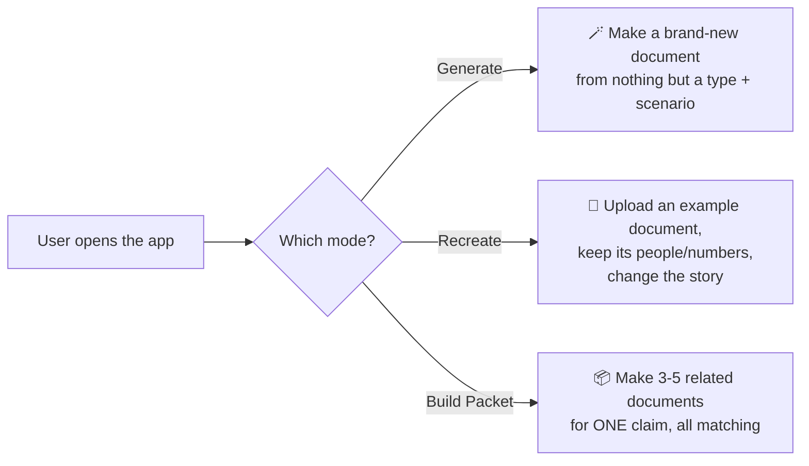

**Generate** — "Give me a Police Report for a rear-end collision." The app invents a driver, a car, a date, an officer — everything.

**Recreate** — "Here's a real form I found, make a NEW fake one that looks like it, but for a different scenario." The app reads the uploaded file, keeps the same person's name/policy number/etc., but writes a fresh story for the new scenario.

**Build Packet** — "Give me every document for one auto accident claim." The app creates 5 documents (police report, accident report, medical notes, medical bill, insurance certificate) that all agree with each other — same person, same claim number, same date.

---

## 3. The big picture — everything at once

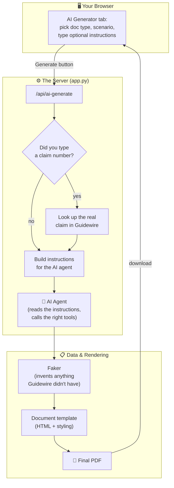

**In plain words:** you click a button in the browser → the server checks if you mentioned a real claim → if yes, it fetches the real claim → it builds a set of instructions → an AI agent follows those instructions, filling in gaps with fake data where needed → a PDF comes out the other end.

---

## 4. Step by step: what happens when you click "Generate"

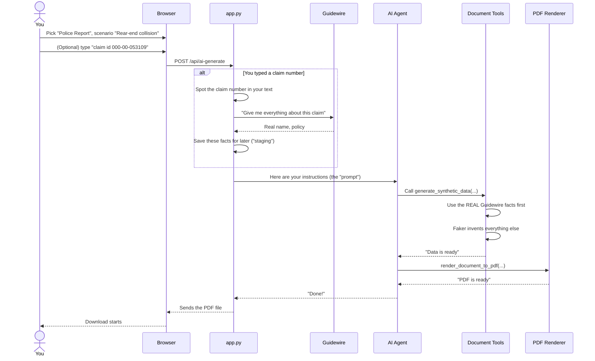

---

## 5. The Guidewire lookup, in detail

This is the part that makes documents *real* instead of purely fake.

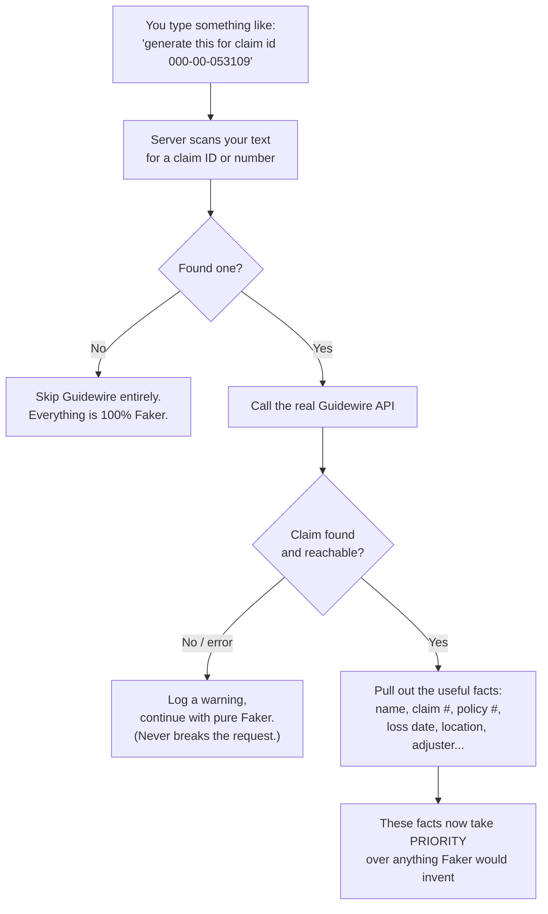

**The golden rule:** *Guidewire data first, Faker fills the gaps.* Nothing ever breaks just because Guidewire is slow, down, or the claim doesn't exist — it just quietly falls back to normal fake-data generation.

### What we actually pull from Guidewire

| From Guidewire | Lands on | Example |
|---|---|---|
| `claim_number` | Every document's claim number field | `000-00-053109` |
| `policy_number` | Every document's policy number field | `9185479590` |
| `insured` (the person) | Whichever field THAT document uses for the person's name | see next section |
| `loss_date` | Anchors every date field so nothing is chronologically wrong | see §7 |
| `loss_location` | The location field, wherever one exists | `4521 Maple Grove Rd, Columbus, OH` |
| `loss_type` / `loss_cause` | Extra context facts, where relevant | `Auto` / `Collision with pedestrian` |
| `assigned_adjuster`, `jurisdiction`, `policy_type`... | Whichever field matches | — |
| Agent's name (from the claim's contact list) | ACORD-25's "producer" field | — |
| Adjuster's own notes + real attached documents | Free-text context (see §8) | — |

---

## 6. The tricky part: "the same person" has a different field name on every document

This was a real bug we found and fixed. Every document type calls "the claimant's name" something different:

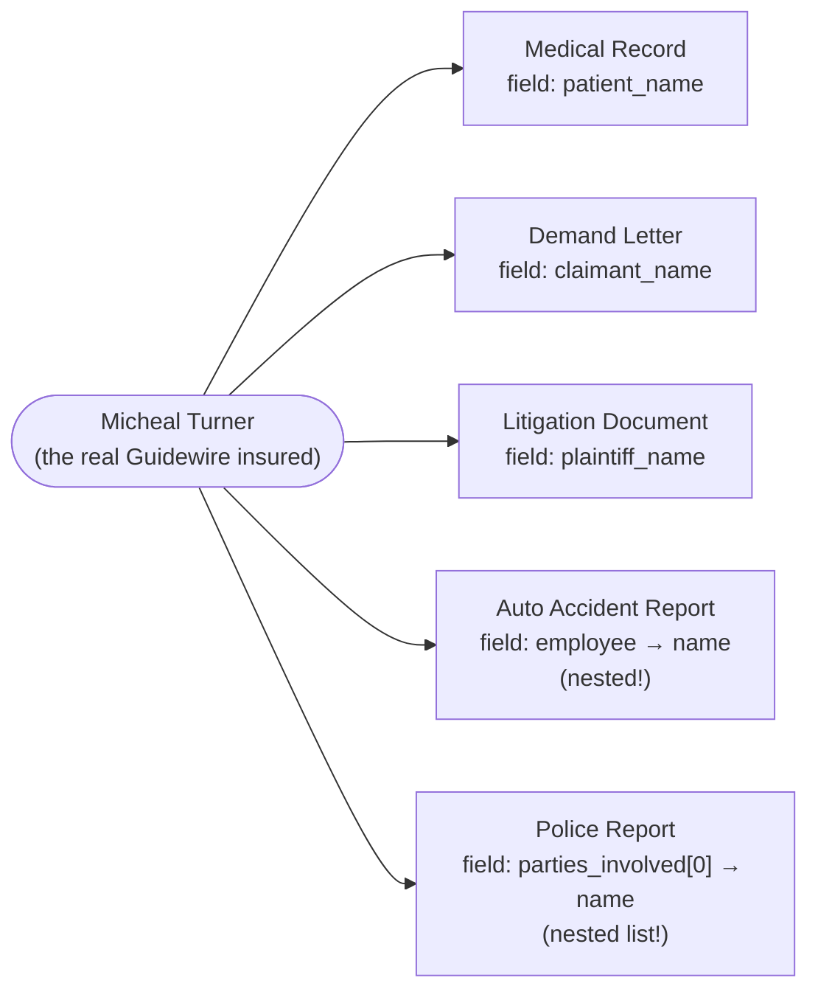

Without special handling, putting "Micheal Turner" into a document only works if you happen to guess the right field name. So the app has an **alias table** — one function that knows all five names for "the claimant" and fills in whichever one a given document actually uses, including reaching inside nested boxes (like `employee.name`).

> 🐛 **Real bug this fixed**: the Auto Accident Report's "STATE EMPLOYEE" section never had a name field in the template *at all* — you could see the *other* driver's name, but never the claim owner's. We added the missing field to both the data and the printed form.

---

## 7. The date problem: "the report can't be older than the incident"

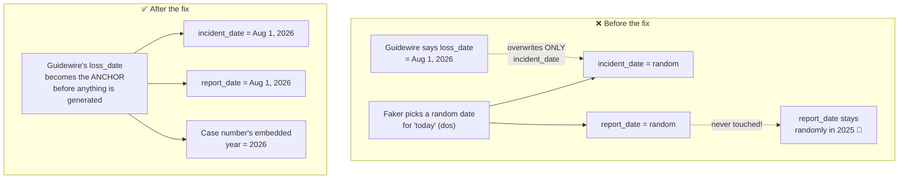

**The old approach**: generate everything randomly first, then paste the real date onto ONE field. Every *other* field that depended on "today's date" (report date, case numbers with the year baked in, etc.) never found out about the real date.

**The fix**: the real loss date is now used as the *starting point* for generation, not a patch applied afterward. Every date-based field is computed *from* it, so they're automatically consistent — no field can end up in a different year than the real incident.

---

## 8. Claim notes & real attached documents — used, but never "dumped"

Guidewire also has messy, free-text stuff: the adjuster's own notes, and snippets from real documents already on the claim (a real police report narrative, a real ER summary). We use this — but carefully, because it's prose, not clean field values, and different document types need it applied differently.

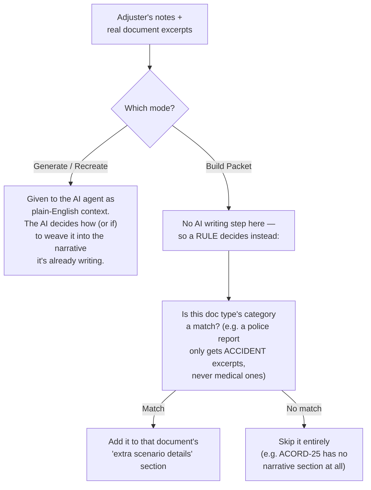

**Why this matters**: an earlier version of this dumped the SAME big block of notes into every single document in a packet, whether it made sense there or not. That's wrong — a Certificate of Insurance has no place for "the ER discharge summary said..." So now, each document only gets the notes/excerpts that are actually *about* that kind of document.

---

## 9. Build Packet — how five documents end up agreeing with each other

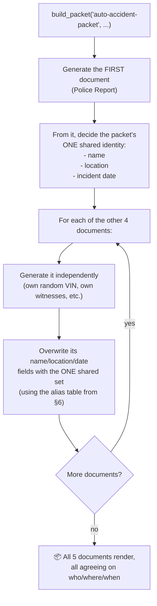

This works **whether or not** you gave it a real claim: if you did, "the shared identity" comes from Guidewire; if you didn't, it's just whatever the first document randomly generated — either way, every document in the packet tells the same story.

---

## 10. Two safety nets, not one — how the data *actually* gets applied

This was the trickiest bug to find. Early on, Guidewire's data was described in the AI's instructions as *text* — like a note taped to the AI's desk saying "please use this." The problem: an AI reads a prompt, it doesn't *execute* it like code. A big block of text describing 15 fields could get skimmed, mis-copied, or dropped entirely.

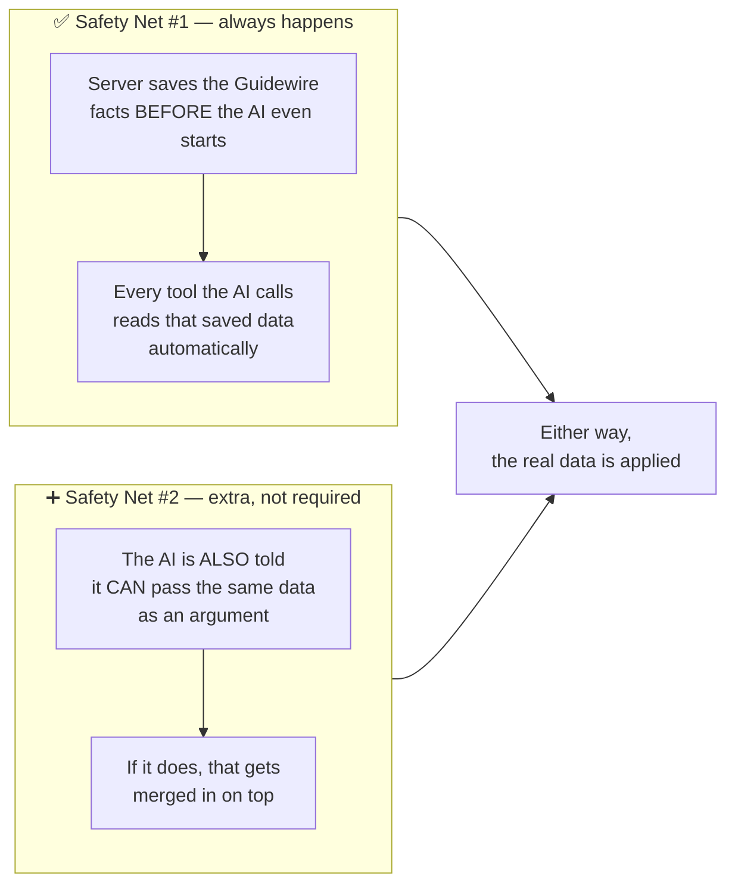

**In short**: the server doesn't *hope* the AI remembers to use the real data — it stages it directly where the document-building code will find it, guaranteed. The AI can *also* pass it explicitly (useful if it found something extra worth adding), but the guaranteed path never depends on the AI doing the right thing.

---

## 11. A complete walkthrough — one real example

Let's trace one real request end to end: **"Build the Auto Accident Packet for claim 000-00-053109."**

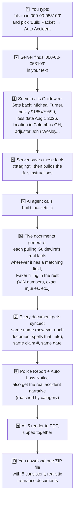

**The result**: a Police Report, an Auto Loss Notice, ER Visit Notes, an ER Bill, and an ACORD-25 Certificate — all about "Micheal Turner," all with claim number `000-00-053109`, all dated August 1, 2026 — some of them (the ones about the accident itself) even echoing real detail from the actual claim file.

---

## 12. What happens when things go wrong

```mermaid
flowchart TD
    A{What failed?} -->|Guidewire unreachable\nor claim not found| B["✅ Falls back to pure Faker.\nRequest still succeeds."]
    A -->|No claim ID typed at all| C["✅ Normal - just uses Faker\nlike Guidewire was never involved."]
    A -->|Reference upload doesn't\nmatch the document type| D["⚠️ Reports which values\ncouldn't be placed\n('unmapped_keys'),\nrest still generates fine."]
    A -->|The AI agent itself\n(the LLM) fails or errors| E["❌ This is the one real\nfailure point - needs the\nfull AI framework running\n(only available on the Linux VM,\nnot this local dev sandbox)."]
```

Almost every failure mode quietly degrades to "just use fake data" rather than blocking you. The one hard requirement is the AI agent itself, which needs the full server environment to run.

---

## 13. Everything that lives where (a map of the code)

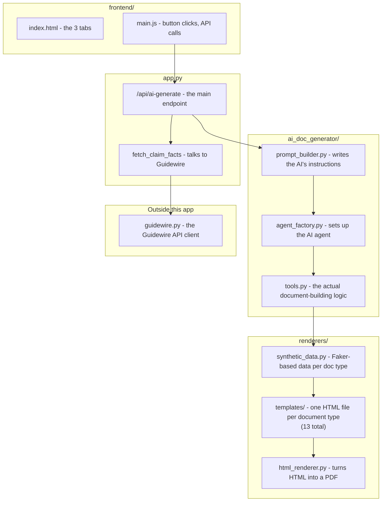

---

## 14. Quick glossary

| Term | Plain-English meaning |
|---|---|
| **Faker** | A tool that invents realistic-looking fake data (names, addresses, dates) |
| **Scenario** | The "story" a document tells (e.g. "rear-end collision," "fire damage") |
| **Packet** | A bundle of 3-5 related documents about one fake claim |
| **Staging** | Saving data on the server *before* the AI runs, so the document-building code can find it reliably |
| **Anchor date** | The real incident date, used as the starting point for every other date in a document |
| **Alias table** | The lookup that knows "insured_name," "patient_name," and "employee.name" all mean the same thing |
| **Skill file** | A short reference doc telling the AI what fields a document type has |
| **Tool** (AI sense) | A specific action the AI is allowed to take, like "generate data" or "render a PDF" |

---

*This document describes the app as of this session's changes. If the code changes significantly, this file should be updated to match.*
